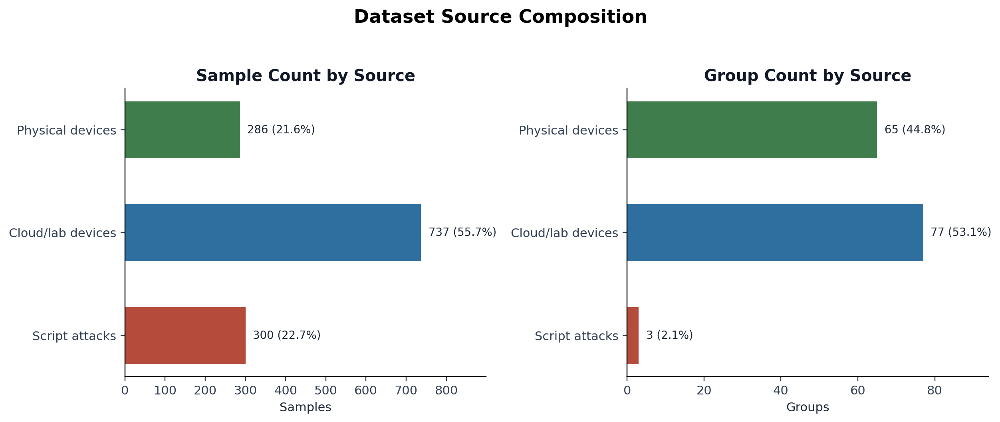
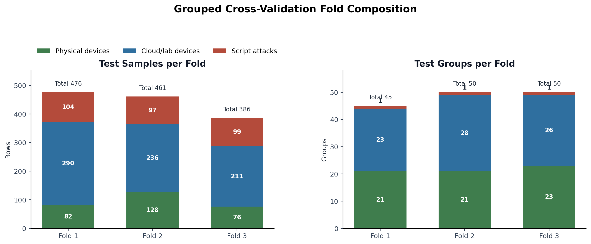
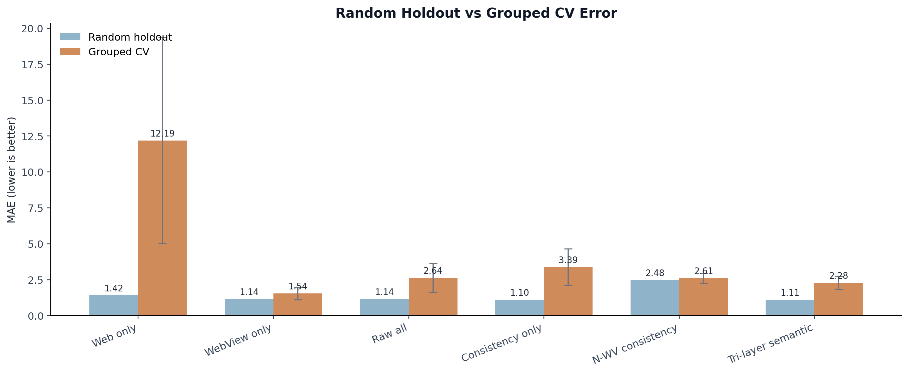
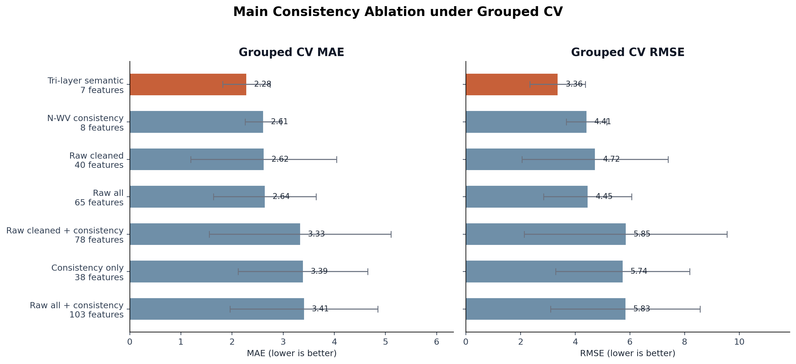
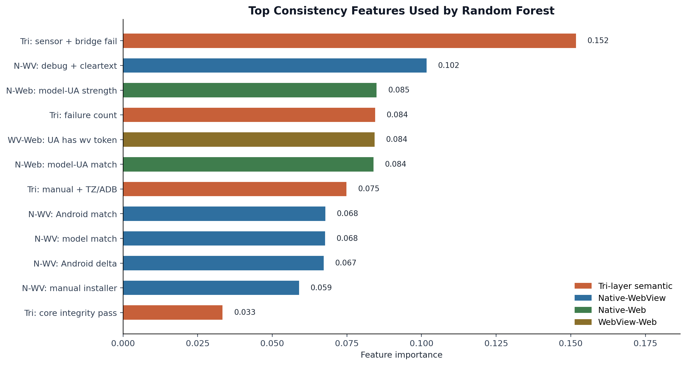

# 论文与答辩图片说明

本文档整理 `ablation/` 目录下适合用于论文正文、实验章节和答辩展示的图片材料。推荐主线使用 `figures/` 下新生成的五张图，原有实验脚本生成的图片作为补充材料或答辩备查。

重新生成五张主图的命令：

```bash
conda run -n cross-device-fingerprint python ablation/make_figures.py
```

## 推荐主图

### 图 1：数据来源构成

文件：`figures/figure_01_source_distribution.png`



数据来源：`grouped_sample_metadata.csv`、`grouped_source_group_summary.csv`

用途：适合放在论文“实验数据集”或“实验设置”部分，也适合作为答辩中介绍数据来源的第一张实验图。

图中左侧展示三类数据的样本数量，右侧展示三类数据的设备/模板分组数量。当前数据集中云测真机/测试机架设备样本最多，真实物理设备和脚本攻击样本数量接近；但从分组数量看，脚本攻击只有 3 个主模板，而真实物理设备和云测设备包含更多独立设备组。这个图可以用来解释为什么后续必须做分组交叉验证：如果只按样本行随机切分，同一设备或同一脚本模板的近似样本很容易同时进入训练集和测试集。

### 图 2：分组交叉验证 Fold 构成

文件：`figures/figure_02_fold_distribution.png`



数据来源：`grouped_fold_source_distribution.csv`

用途：适合放在论文“分组交叉验证设计”部分，用来证明实验划分是可解释、可复现的。

图中左侧展示每个测试 fold 中三类来源的样本数量，右侧展示每个测试 fold 中三类来源的分组数量。每一折测试集都包含真实物理设备、云测设备和脚本攻击数据，同时每个脚本攻击模板只出现在一个测试 fold 中。这说明第三版实验不是简单随机切分，而是在尽量避免同源设备/同源模板泄漏的前提下评估模型泛化能力。

### 图 3：随机 Holdout 与分组交叉验证误差对比

文件：`figures/figure_03_holdout_vs_grouped_mae.png`



数据来源：`ablation_summary.csv`、`consistency_ablation_summary.csv`、`grouped_ablation_summary.csv`

用途：适合用于解释“为什么最终采用分组交叉验证作为主实验”。答辩时也可以用这张图回答“为什么快速版指标看起来都很好”的问题。

图中对比了随机 holdout 和分组交叉验证下的 MAE。随机 holdout 下，大多数配置误差都很低，说明测试集与训练集之间可能存在同源样本相似性；分组后，部分配置误差显著上升，尤其是 Web only。这说明分组评估更接近未见设备、未见云测环境和未见攻击模板的泛化场景。该图的重点不是说明某个配置绝对最优，而是说明第三版实验比快速版更严格。

### 图 4：分组版一致性消融主结果

文件：`figures/figure_04_grouped_main_results.png`



数据来源：`grouped_ablation_summary.csv`

用途：建议作为论文实验章节的核心结果图之一。它直接支撑“三端融合不是简单拼接字段，而是跨层一致性建模”的主张。

图中只展示与一致性建模相关的主要配置，并同时给出 MAE 和 RMSE。`Tri-layer semantic` 仅使用 7 个三端语义规则特征，在分组交叉验证中取得最低 MAE 和 RMSE，优于完整三端原始特征 `Raw all`。这说明在更严格的未见设备/未见模板划分下，少量三端语义一致性特征仍然具备较强泛化能力。图中的误差线表示三折之间的标准差，可用于说明结果稳定性。

### 图 5：跨层一致性特征重要性

文件：`figures/figure_05_consistency_feature_importance.png`



数据来源：`consistency_top_feature_importance.csv`

用途：适合放在论文“特征重要性分析”部分，也很适合答辩中解释随机森林到底学到了什么。

图中展示 `Consistency only` 配置下随机森林最依赖的 12 个一致性特征。重要性最高的特征包括传感器严重缺失与 JSBridge 缺失、debuggable 与 cleartext 配置张力、Native 设备型号与 Web UA 的宽松匹配强度、三端一致性失败数量等。这个结果说明模型并不是只记忆原始字符串，而是在利用已经编码好的跨层语义关系进行风险分拟合。

需要注意的是，特征重要性来自快速 holdout 版 `Consistency only` 随机森林，主要用于解释模型决策逻辑；泛化能力的主结果仍建议以分组交叉验证图表为准。

## 补充图片

### 粗粒度三端消融误差图

文件：`ablation_error_metrics.png`

数据来源：`ablation_summary.csv`

用途：适合作为早期快速实验或附录图。它展示 Native、WebView、Web 单端/双端/三端原始特征在随机 holdout 下的 MAE 和 RMSE。该图可以用来说明简单按端删除并不能充分体现三端融合价值，因为三端原始字段之间存在较强冗余。

### 粗粒度三端消融高风险 F1 图

文件：`ablation_high_risk_f1.png`

数据来源：`ablation_summary.csv`

用途：适合作为答辩备查，不建议作为论文主图。随机 holdout 下高风险 F1 基本饱和为 1.0，说明当前高风险样本具有明显规则特征，但它对区分不同特征组的贡献有限。

### 快速版一致性消融误差图

文件：`consistency_ablation_error_metrics.png`

数据来源：`consistency_ablation_summary.csv`

用途：适合作为“从粗粒度消融转向一致性消融”的过渡图。它展示随机 holdout 下 `Consistency only` 和 `Tri-layer semantic` 可以达到甚至略优于 `Raw all` 的误差水平，用于说明跨层一致性特征本身具有有效信息量。

### 快速版一致性消融高风险 F1 图

文件：`consistency_ablation_high_risk_f1.png`

数据来源：`consistency_ablation_summary.csv`

用途：适合作为附录或答辩备查。与粗粒度 F1 图类似，该图在随机 holdout 下区分度有限，主要用于说明高风险样本在当前标签体系下容易被识别。

### 分组版粗粒度三端消融图

文件：`grouped_coarse_error_metrics.png`

数据来源：`grouped_ablation_summary.csv`

用途：适合放在附录或答辩补充页。它展示分组交叉验证后各单端/双端/三端原始特征组合的误差变化，可以用来说明 Web only 和 Native + Web 在未见模板场景下泛化较弱，WebView 层在当前数据集中包含较强规则信号。

### 分组版一致性消融图

文件：`grouped_consistency_error_metrics.png`

数据来源：`grouped_ablation_summary.csv`

用途：适合作为图 4 的完整补充。图 4 为了展示清晰只保留了主要配置，而该图包含全部一致性配置，包括 Native-Web、Native-WebView、WebView-Web 和 Tri-layer semantic。论文中如果篇幅允许，可以将图 4 放正文，将该图放附录。

## 推荐使用顺序

论文正文建议使用以下顺序：

1. `figure_01_source_distribution.png`：说明数据来源。
2. `figure_02_fold_distribution.png`：说明分组交叉验证设计。
3. `figure_03_holdout_vs_grouped_mae.png`：说明为什么快速 holdout 不作为最终主实验。
4. `figure_04_grouped_main_results.png`：给出第三版核心实验结果。
5. `figure_05_consistency_feature_importance.png`：解释模型使用了哪些跨层一致性信号。

答辩展示建议更精简：

1. 数据来源构成。
2. Holdout 与分组交叉验证对比。
3. 分组版一致性消融主结果。
4. 特征重要性。

如果老师追问“为什么完整三端不是最优”或“为什么不用简单按端消融作为结论”，再展示粗粒度消融图和分组版完整一致性消融图。
