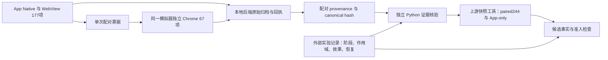

# Browser67 双端先导实验：设计与复核方法

本次任务完成攻击侧的采集与质量控制，为 App177＋独立 Browser67 的 paired244 研究提供可接入的数据。实验目标是证明两端来源、浏览器控制时点、实际字段效果和恢复，而不是计算攻击检测准确率。上游当前固定提交为 `a16ba9dea3078a66b4e8e4338d00d9dd9df9893b`；实际构建使用 FeatureApp versionCode 16、Browser probe `expanded-web-67-v2`，历史文档中的 versionCode 8／probe v1 不作为新批次的锁。

初次目录的 Windows Git checkout 将探针变成 CRLF，实际字节 SHA256 与清单中的 LF SHA256 不同。原批次的字段观测和恢复结果保留为工程证据，但不获得“传输字节与上游一致”的准入。本目录重新构建并复采；源码与 Git blob 比对，实际 Browser 文件、App APK 内探针和清单均使用同一 LF 字节身份。原目录22条App／19条Browser配对与5次工程尝试单独记在 `engineering_history_summary.json`，不混入本批次分母。

## 数据如何流动

采集器负责运行和保存记录；后端负责原始上传、回执、配对和批次生命周期；独立核验器重新读取原始文件，不导入采集器代码；上游快照工具仅生成派生数据。实验标签、工具和控制参数保留在外部 sidecar 中，模型特征只取固定字段目录。这种职责分离使我们能检查采集器是否正确，而不是只相信它输出的“成功”。

## 控制、观测与恢复

使用一台自有 API36 模拟器、独立 Chrome 133，两种配置各重复三次：语言 `fr-FR` 和时区 `Asia/Tokyo`。每次按 `clean_pre → attack_active → clean_post` 采集，最终选定批次固定18个阶段、6个完整三阶段组。

Chrome DevTools Protocol 是浏览器调试接口，可在当前页面运行代码或设置浏览器环境。本实验用它只控制独立浏览器。语言控制改变 `navigator.language/languages`；时区控制改变 `Intl` 时区和时间偏移。App 侧目标语言／时区字段应保持原值，浏览器目标字段应只在 active 阶段改变，post 阶段应恢复 pre 值。其他字段允许因采样时间、权限和容器环境自然变化。

页面原始 HTML、bootstrap 和 core 正常返回，适配脚本暂缓返回。页面运行环境确认后安装控制，再放行与上游字节完全相同的适配脚本。记录顺序必须为页面绑定／控制完成／脚本放行／浏览器上传／撤销／页面关闭。冷启动 Chrome 的调试接口需先由唯一的无脚本本地空白页面启动；该页面不采集、不上传任何指纹。

App 和 Browser 使用单阶段 `browser_pair_id` 配对；三个阶段使用另一独立 `scenario_group_id` 关联。回连依赖 session、receipt、canonical payload hash 和 batch，不能按时间最接近或字段最相似猜配对。

## 为什么保留失败、为什么暂不计算准确率

每次工程尝试的18个计划槽位都保留，包括 failed 和 skipped。未完成 Browser 的 App 不删除，进入 App-only 库存。选定成功批次的18／18只描述该批次的完成情况，不能掩盖之前工程失败或变成总体成功率。

6个三阶段组来自同一模拟器，不等于6个独立设备。当前稳定身份只到 `run_scoped_unverified`，最小准入事实为 `candidate`，旧 sample-manifest 对应 `pending`。上游准入程序应生成空的正式 split，并保持 `structural_ready=false`、`grouped_data_prerequisites_met=false`。升级为正式标签、可信跨运行分组和 held-out 评价仍需新的证据。

## 交付与复核

`delivery/delivery_manifest.json` 是传输索引，包含所选批次、各类计数和文件 SHA256。`delivery/paired244_snapshot/` 是上游工具的派生快照；`delivery/latest_experiment_facts.jsonl` 用 App session＋payload hash 双重绑定；`delivery/attack_sample_manifest.jsonl` 保存完整作用域、App／Browser效果差异、恢复和证据引用。

后端先通过 `backend.stop` 协作关闭，再导出 session provenance；不能直接杀进程并声称批次已干净关闭。独立核验的输出包含全部输入文件 hash，交付构建器再次核对这些 hash，以防旧的“通过”报告被用于新数据。

完整复核需当前冻结源码、源 APK 和从模拟器拉取的已安装 APK；只比较版本号不足以证明两个 APK 是同一构建。复核命令为 `python verify_pilot.py --pilot <delivery_manifest中的selected_pilot>`，再执行同参数加 `--self-test`。自测试仅修改临时副本，原始证据保持不变。

本地完整证据包含模拟器指纹和关联标识；外发时使用单独的摘要包。HMAC密钥、旧设备数据备份、Chrome配置与第三方应用不进入交付归档。
