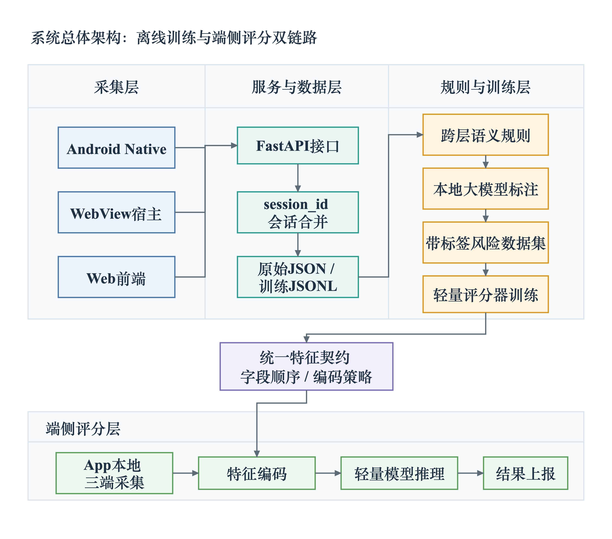
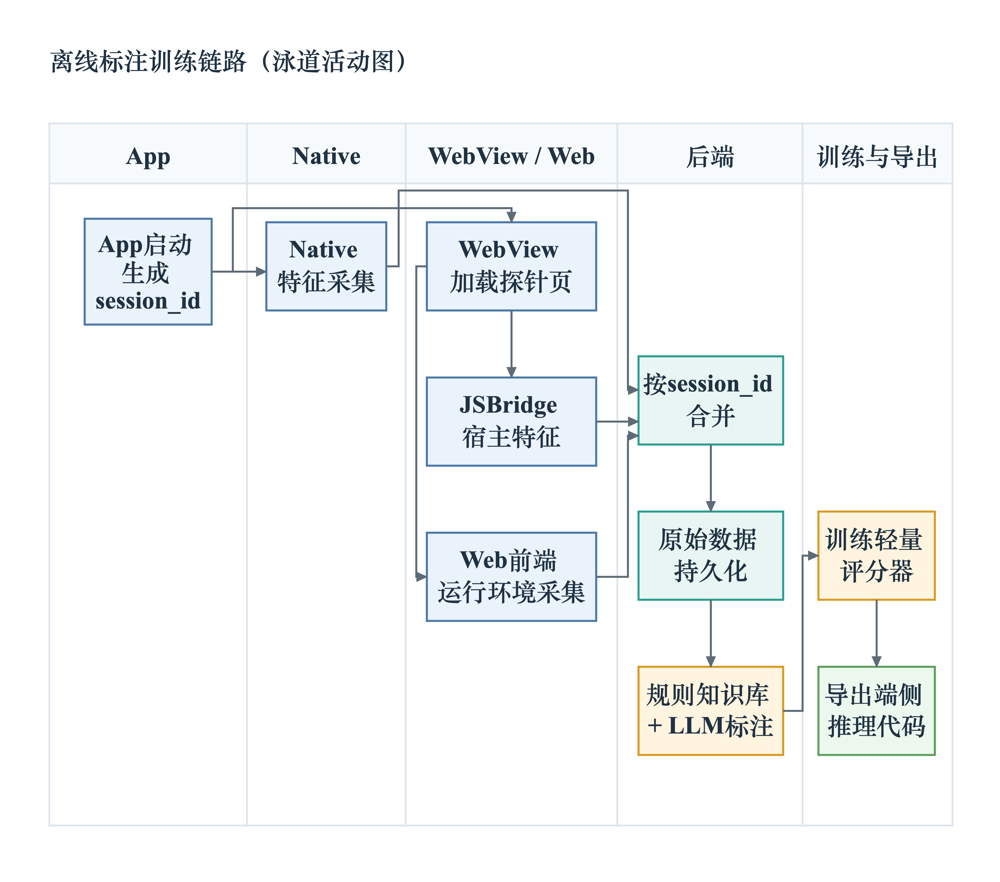
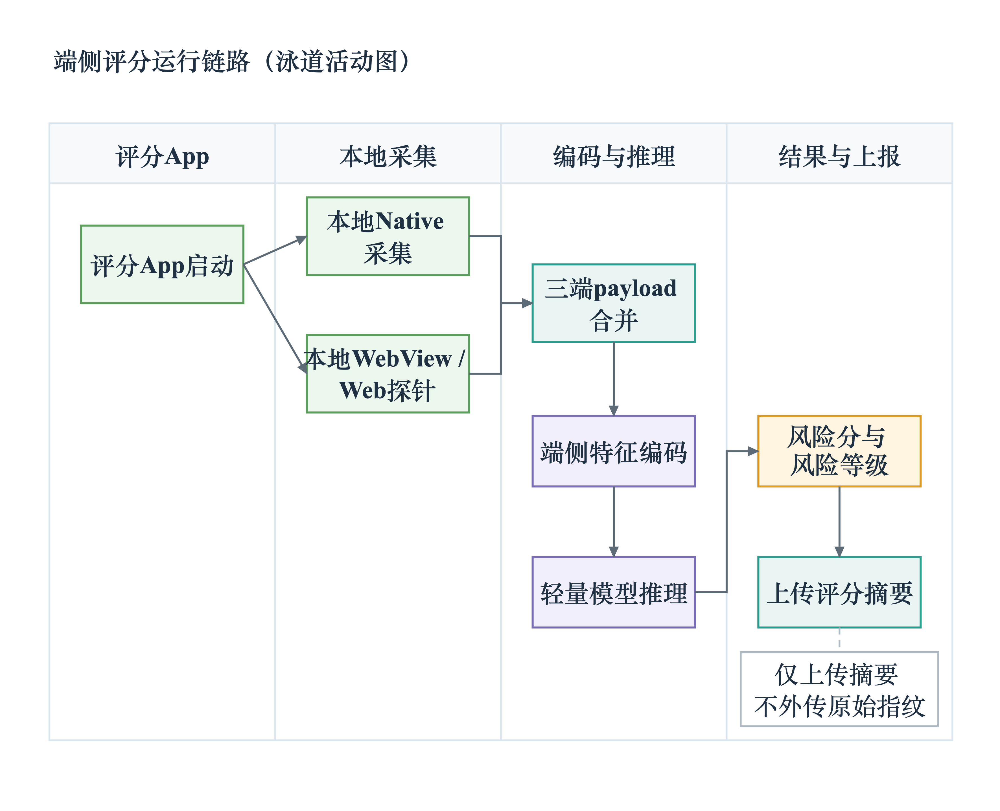
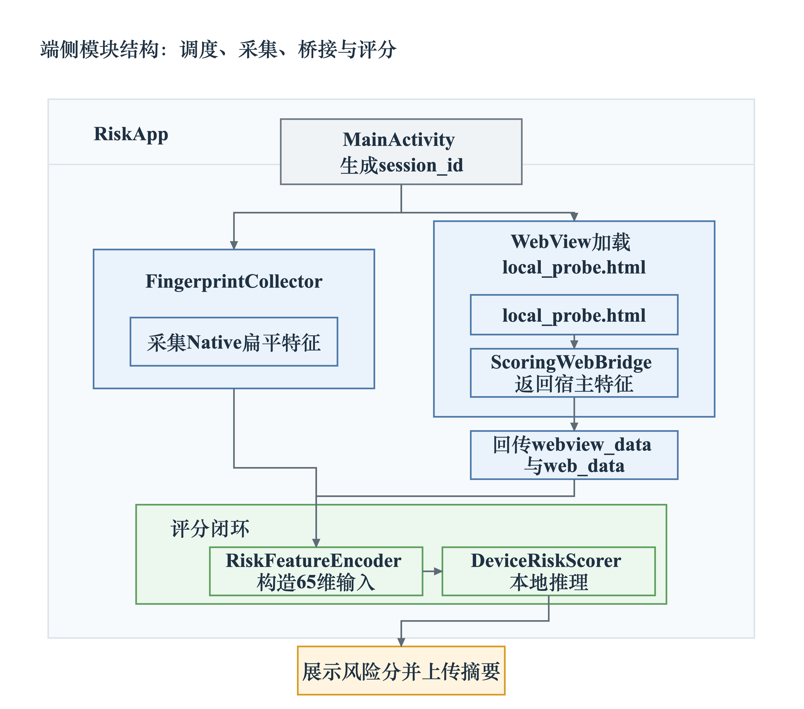

# RBA多端关联设备身份交叉验证机制答辩讲稿（19页版）

题目：RBA中基于Web-WebView-Android多端关联的设备身份交叉验证机制研究

说明：本讲稿按当前PPT页序组织，预计答辩时间约15分钟。整体口径按导师意见调整为“研究背景、意义与目的、研究内容、研究方法、工程实现、实验设计与结果、总结”，重点说明本研究做了什么、为什么做、怎样实现、结果如何。演示视频本版暂不加入。

## 时间分配总览

| 环节 | 对应页 | 建议时间 |
|---|---|---:|
| 开场与研究背景 | 第1-2页 | 1分30秒 |
| 研究意义、目的与内容 | 第3-4页 | 1分45秒 |
| 研究方法与技术路线 | 第5、8、9页 | 2分30秒 |
| 工程实现 | 第6、7、10、11页 | 3分钟 |
| 实验设计与实验结果 | 第12-17页 | 4分30秒 |
| 不足、展望与总结 | 第18-19页 | 1分15秒 |
| 合计 | 19页 | 15分钟左右 |

## 第1页：题目与开场

预计时间：35秒

PPT内容：

- 论文题目
- 核心主张
- 三端融合采集、会话对齐、规则知识库离线标注、端侧轻量评分闭环

讲稿：

各位老师好，我的毕业论文题目是《RBA中基于Web-WebView-Android多端关联的设备身份交叉验证机制研究》。

本文面向RBA移动端风控场景，研究同一次移动端会话中，Web、WebView和Android三类证据如何采集、对齐，并形成可解释的设备身份交叉验证机制。

整篇论文的工作可以概括为四个关键词：三端融合采集、`session_id`会话对齐、规则知识库离线标注，以及端侧轻量评分闭环。接下来我会按研究背景、意义与目的、研究内容、方法路线、工程实现和实验验证这几个部分进行汇报。

## 第2页：研究背景

预计时间：55秒

PPT内容：

- RBA移动应用需要识别跨层设备身份异常
- Android Native、WebView宿主、Web前端三类证据

讲稿：

首先介绍研究背景。RBA，也就是基于风险的认证，核心目标是在登录、交易等关键环节判断访问环境是否可信，并根据风险程度调整认证强度。

在移动App中，尤其是包含WebView的业务场景里，一次访问同时经过三层环境。Android Native层能看到设备型号、系统版本、物理屏幕、电池、传感器和ADB等底层信息；WebView宿主层能反映JSBridge、WebView Provider、默认UA、安装来源和调试配置；Web前端层能看到Navigator、DPR、WebGL、Canvas、时区和算力表现。

这些信息单独看都能提供风险线索，但局部字段可能被伪造、重放或遮蔽。因此，本研究关注的是同一会话内多层证据是否相互一致，用跨层关系识别设备身份异常。

## 第3页：研究意义与目的

预计时间：55秒

PPT内容：

- 移动端RBA需要跨端互证能力
- 低打扰、少外传、可解释
- 机制设计、工程实现、实验验证

讲稿：

这一页说明研究意义和研究目的。已有风控方法可以采集设备字段，也可以做端侧推理，但在移动端RBA场景中，仍需要解决三个实际问题。

第一，局部字段容易被伪造或复用，所以需要从单字段判断走向三端一致性验证。第二，Web、WebView和Android证据分散在不同运行层，需要用同一个`session_id`把它们对齐到同一会话。第三，完整原始指纹外传会增加传输和合规压力，所以端侧更适合输出风险分、风险等级和解释摘要。

因此，本文围绕“同一会话是否来自同一可信设备环境”这一问题，完成机制设计、工程实现和实验验证。

## 第4页：研究内容

预计时间：50秒

PPT内容：

- 三端设备指纹采集
- 会话合并与数据持久化
- 跨层语义规则知识库
- 离线标签与轻量评分器
- Android端侧评分闭环

讲稿：

围绕这个目标，本文主要完成五项研究内容。

第一，设计Web、WebView和Android三端分层采集方案，并统一到同一个`session_id`。第二，实现后端会话合并和数据持久化，支持异步上报、增量合并，以及原始JSON和训练JSONL共存。第三，构建跨层语义规则知识库，沉淀屏幕、UA、JSBridge、传感器、WebGL等一致性规则。第四，利用规则知识库约束离线标签生产，再训练轻量评分器。第五，在Android端实现本地采集、65维编码、随机森林推理和摘要上报。

这五部分分别对应论文中的系统设计、工程实现和实验分析。

## 第5页：研究方法与技术路线

预计时间：1分5秒

建议图示：

讲稿：

这一页是本文的技术路线。整体方法可以分为离线链路和在线链路。

离线链路负责规则沉淀、数据标注和模型训练。采集到的三端样本先进入服务与数据层，再结合规则知识库进行风险语义分析，最终形成可训练的风险标签和轻量评分器。

在线链路负责端侧验证和评分。端侧应用在本地完成Web、WebView和Android三端证据收集，按训练阶段一致的字段顺序构造特征，再输出风险分、风险等级和原因摘要。

这里的关键思路是：复杂的跨层语义分析放在离线阶段完成，运行时则用轻量模型在端侧执行，从而兼顾可解释性和部署成本。

## 第6页：研究内容一：三端采集

预计时间：45秒

PPT内容：

- Android Native 33个字段
- WebView宿主14个字段
- Web前端18个字段
- Raw all完整特征65维

讲稿：

这一页回答“采什么”。本研究将设备身份线索划分为三端。

Android Native侧采集33个字段，主要描述底层设备真实性和物理环境，例如型号、系统、屏幕、电池、传感器和ADB状态。

WebView宿主侧采集14个字段，主要判断页面是否运行在预期App容器中，例如JSBridge、Provider、宿主UA、安装来源和debuggable配置。

Web前端侧采集18个字段，主要描述网页脚本实际观察到的运行环境，例如UA、DPR、WebGL、Canvas、时区和算力。三端合计形成65维Raw all基线特征，也作为后续训练和端侧编码的基础。

## 第7页：研究内容二：会话对齐

预计时间：45秒

PPT内容：

- Native、WebView、Web异步上报
- FastAPI接收
- `session_id`增量合并
- merged JSON与training JSONL

讲稿：

这一页回答“怎么关联”。在实际运行中，Native、WebView和Web数据并不一定同时到达。Native可能先上报，WebView和Web探针随后才完成采集。

因此，后端以`session_id`作为会话键，通过FastAPI接口接收三端数据，并采用增量合并策略。新到达的数据只补充或更新非空字段，避免后续上报覆盖已有信息。

合并后的结果保留原始嵌套JSON，便于审计和追踪；同时展开为训练用JSONL，便于离线标注、模型训练和消融实验。

## 第8页：研究方法一：规则知识库

预计时间：55秒

建议表格：

| 规则类别 | 关联特征层 | 规则含义 | 风险解释 |
|---|---|---|---|
| 屏幕一致性 | Native屏幕 + Web屏幕 | 逻辑分辨率x DPR应近似对应物理分辨率 | 偏差过大可能说明Web环境被伪造 |
| UA一致性 | Native Build + WebView UA + Web UA | 系统版本、机型和内核版本应相互呼应 | 不一致可能说明UA改写或请求重放 |
| 宿主真实性 | JSBridge + session_id | Web页面应能通过JSBridge获取同一会话 | 缺失可能说明外部浏览器或脚本绕过App |
| 物理可信性 | 传感器 + 电池 | 真机通常具备合理传感器矩阵和动态电池状态 | 传感器极少或电池死值可能说明模拟器 |
| 渲染环境 | WebGL + Native硬件 | GPU renderer应符合移动端硬件生态 | SwiftShader、Headless、PC GPU属于高风险线索 |

讲稿：

这一页回答“怎样形成判断依据”。本文将原始字段进一步整理为跨层规则知识库，把单个字段的异常转化为可解释的关系判断。

例如屏幕一致性规则会比较Native物理分辨率和Web侧逻辑分辨率乘以DPR之间是否接近；UA一致性规则会比较Native Build、WebView UA和Web UA中的系统版本、机型和内核信息是否相互呼应；宿主真实性规则会关注Web页面是否能通过JSBridge获取同一会话。

这些规则的作用有两个：一是辅助离线标签生产，让风险判断有统一边界；二是为后续模型解释提供语义来源，使评分结果能够回溯到具体的跨层关系。

## 第9页：研究方法二：离线标注

预计时间：50秒

建议图示：

讲稿：

这一页说明离线标注流程。大模型在本文中只参与离线训练数据标注，在线端侧不依赖大模型服务。

具体来说，三端样本先经过规则知识库约束，规则会提供屏幕、UA、JSBridge、传感器、WebGL等一致性判断边界。随后，大模型结合这些结构化规则和样本字段，生成风险分和风险原因。最终，这些标签被用于训练轻量评分器。

这样设计的好处是，复杂语义分析在离线阶段完成；在线阶段只需要端侧模型承接规则语义，输出可部署、可解释的风险评分。

## 第10页：工程实现：端侧评分闭环

预计时间：55秒

建议图示：

讲稿：

这一页进入工程实现。端侧应用运行时在本地完成三端采集、特征编码和轻量模型推理。

首先，Native、WebView和Web探针在端侧形成同一会话输入。然后，编码器按照训练阶段确定的字段顺序构造65维模型输入。接着，随机森林评分器输出0到100的风险分和风险等级。

最后，端侧只向后端返回风险分、风险等级和解释摘要，降低原始三端指纹外传。这个闭环体现了本文的工程目标：把离线规则和训练结果压缩到端侧可以运行的轻量评分流程中。

## 第11页：工程实现要点：65维特征约束

预计时间：40秒

建议图示：

讲稿：

端侧实现中最重要的约束是训练侧与端侧共享同一套65维特征定义。

`RiskFeatureEncoder`负责固化字段顺序、类别映射、布尔值转换和缺失值处理。这样可以保证端侧构造出的输入数组与训练阶段模型看到的特征语义一致。

`DeviceRiskScorer`则由m2cgen导出的Java代码实现，负责在Android端执行随机森林推理。这里的工程重点是保持训练侧和端侧一致，避免模型输入语义发生偏移。

## 第12页：实验工程设计

预计时间：45秒

建议图示：

讲稿：

实验部分围绕数据来源、分组策略和评价指标展开。

当前实验数据包含1323条带风险标签样本，来源包括真实设备、云测环境和脚本攻击模板。三类来源规模分别对应286、737和300条样本。完整原始字段为65维，由33个Android Native字段、14个WebView宿主字段和18个Web前端字段组成。

实验中特别采用分组交叉验证控制同源设备和攻击模板泄漏，使测试场景更接近未见设备和未见攻击模板。后面的主结论也以分组验证结果为准。

## 第13页：实验一：评分器选型

预计时间：45秒

建议表格：

| 模型 | 测试样本数 | MAE | 中位误差 | P90误差 | 最大误差 |
|---|---:|---:|---:|---:|---:|
| 随机森林 | 265 | 1.14 | 1.11 | 2.25 | 6.42 |
| 浅层MLP | 265 | 2.42 | 2.04 | 5.23 | 13.29 |

讲稿：

第一个实验是评分器选型。这里的重点放在工程部署约束和模型稳定性上。

在相同测试样本上，随机森林的MAE为1.14，浅层MLP的MAE为2.42；随机森林的P90误差和最大误差也更低。

结合本文数据形态，随机森林更适合小样本结构化特征；同时它可以通过m2cgen直接导出Java代码，方便接入Android端。树模型还可以提供特征重要性，便于后续解释风险来源。因此本文选择随机森林作为端侧评分器。

## 第14页：实验二：三端消融

预计时间：55秒

建议表格：

| 配置 | 特征数 | Holdout MAE | Grouped MAE | 解释 |
|---|---:|---:|---:|---|
| WebView only | 14 | 1.139 | 1.541 | JSBridge、安装来源、debuggable等强规则信号 |
| Native + WebView | 47 | 1.129 | 2.202 | 底层设备与宿主容器覆盖大量标签逻辑 |
| Native + WebView + Web | 65 | 1.140 | 2.642 | 完整原始三端基线，包含冗余与噪声 |
| Web only | 18 | 1.416 | 12.188 | 未见设备或模板下泛化最不稳定 |

讲稿：

第二个实验是三端消融。这个实验先按Native、WebView和Web三个端进行粗粒度删减，观察不同证据源对评分结果的影响。

结果显示，WebView only在分组验证下MAE为1.541，表现较好，说明JSBridge、安装来源和debuggable等宿主信号具有较强规则性。Native加WebView的Grouped MAE为2.202，也体现了底层设备和宿主容器的组合价值。

完整65维Raw all的Grouped MAE为2.642，说明简单拼接全部原始字段会引入冗余和噪声。Web only在分组验证下误差最高，说明只依赖前端字段面对未见设备或模板时泛化不稳定。

因此，这个实验引出下一步：三端融合的价值应体现在可互证、可发现矛盾的关系特征上。

## 第15页：实验三：一致性特征消融

预计时间：50秒

PPT内容：

- Native-Web：18个特征
- Native-WebView：8个特征
- WebView-Web：5个特征
- Tri-layer semantic：7个特征

讲稿：

第三个实验检验论文的核心假设：跨层关系特征是否比单纯拼接原始字段更适合表达设备身份异常。

本文将原始字段转化为38个一致性特征，包括Native-Web、Native-WebView、WebView-Web以及三端语义特征四类。

其中Native-Web关注型号与UA、Android版本、屏幕DPR和GPU族；Native-WebView关注型号与system agent、debug和宿主安全；WebView-Web关注Provider与UA主版本、WebView token和JSBridge；Tri-layer semantic则关注传感器加JSBridge、manual加时区或ADB、失败计数等三端语义组合。

这个实验的意义在于把“字段值”转向“字段关系”，也是本文机制进入实验指标的关键桥梁。

## 第16页：实验四：分组主结果

预计时间：1分钟

建议图示：

讲稿：

第四个实验是分组验证下的一致性消融主结果。分组交叉验证更接近未见设备和未见攻击模板场景，因此这一页是实验部分的核心结论。

结果显示，7个Tri-layer semantic三端语义特征的MAE为2.281，优于65维Raw all的2.642；Tri-layer semantic的RMSE为3.358，也优于Raw all的4.455。

这说明在更严格的分组验证下，少量核心语义规则比完整原始字段拼接更稳定。换句话说，本文的重点并不在于采集更多字段，而在于把多端证据转化为能够表达跨层一致性的关系信号。

## 第17页：结果解释

预计时间：45秒

建议图示：

讲稿：

这一页从特征重要性解释实验结果。模型较高权重的特征主要集中在跨层失败信号和宿主真实性信号上。

例如传感器、JSBridge、UA、安装来源和ADB等关系特征排在前列。这些特征带有明确的跨层语义，可以回溯到规则知识库中的具体一致性判断。

因此，模型输出的风险分不仅能给出数值，还能关联到具体风险原因，例如宿主容器异常、前端环境与Native环境不匹配、传感器和Web侧行为不协调等。这也是本文强调可解释性的原因。

## 第18页：不足与展望

预计时间：40秒

PPT内容：

- 数据覆盖
- 标签质量
- 端侧评估
- 分组元数据

讲稿：

最后说明不足与展望。当前结论主要成立在原型数据和离线消融边界内，仍有进一步完善空间。

第一，真实物理设备和真实攻击链路覆盖还可以扩大，后续应增加更多品牌、系统版本、WebView内核和网络环境。第二，规则知识库加大模型生成的标签需要更多人工复核，可以加入抽样审核、规则版本管理和冲突处理。第三，端侧评估还需要补充大规模真机运行开销测试，例如采集耗时、推理耗时、内存和稳定性。第四，分组元数据目前仍带有启发式成分，后续采集阶段可以显式记录设备组、模板ID和云测ID。

## 第19页：总结

预计时间：35秒

PPT内容：

- 采集
- 对齐
- 规则化
- 端侧化

讲稿：

总结一下，本文完成了一个面向RBA移动应用的多端关联设备身份交叉验证机制。

在采集方面，本文实现了Web、WebView和Android三端分层指纹采集；在对齐方面，使用`session_id`合并异步上报，并保留原始数据和训练数据；在规则化方面，构建规则知识库约束离线标注，形成可解释风险标签；在端侧化方面，将随机森林导出为Java推理代码，使App能够在本地输出风险分和摘要。

我的汇报到此结束，谢谢各位老师，欢迎批评指正。
