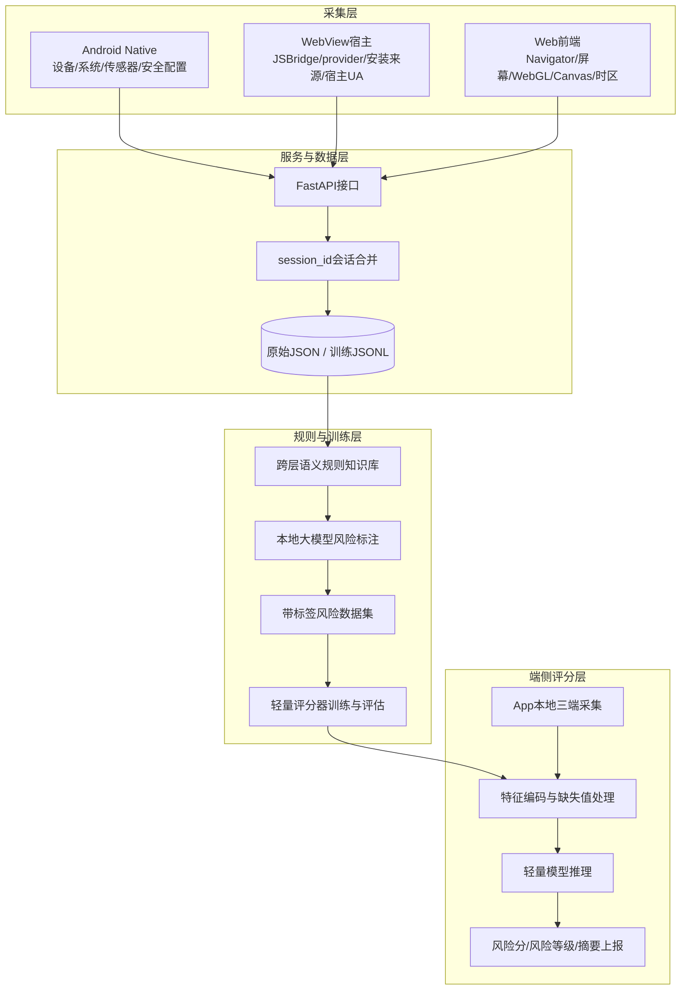
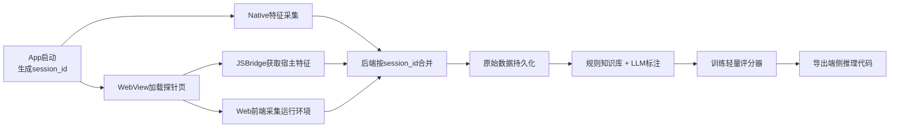
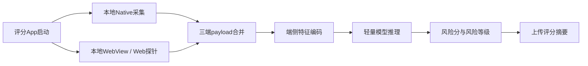
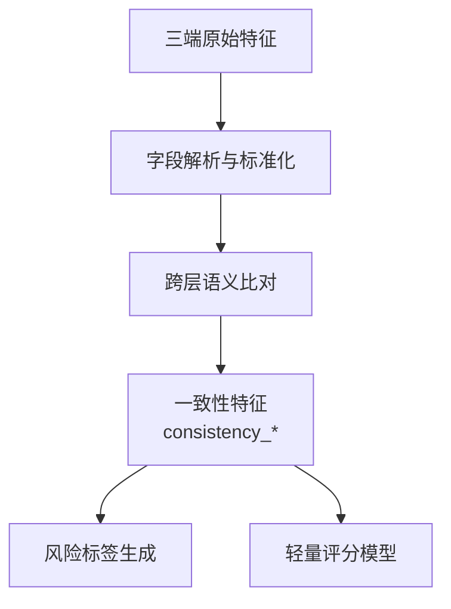

# 第 2 章 系统设计与总体架构

## 2.1 系统设计目标

HybridGuard面向移动端Hybrid App场景，目标是在不显著增加用户交互负担的前提下，对设备环境、App宿主和Web运行时进行联合刻画，并输出可用于风控决策的风险分。与只采集单端字段的设备指纹系统不同，本文关注同一移动端会话中Android Native、WebView宿主容器和Web前端运行环境之间的语义呼应关系。系统设计目标主要包括以下几个方面。

第一，三端融合一致性。系统需要同时采集Native、WebView和Web三类特征，并通过统一会话标识进行对齐，使同一设备在不同层级暴露出的设备型号、系统版本、屏幕参数、浏览器内核、JSBridge和渲染环境等信息能够被联合分析。三端融合的重点不是简单增加字段数量，而是判断不同层级的特征是否能够相互印证。

第二，无感采集。系统采集过程应尽量在App正常启动和WebView页面加载过程中自动完成，不要求用户额外交互。移动端无感风控的价值在于对低风险访问保持较低打扰，而在高风险环境中为后续认证或拦截策略提供依据。

第三，语义规则化。单字段阈值难以覆盖复杂移动端环境。系统需要将Native物理屏幕与Web DPR、Native Build信息与Web User-Agent、WebView provider与Web浏览器内核、JSBridge与App宿主真实性等关系沉淀为跨层语义规则。规则知识库用于表达不同层级特征之间的可解释关系，并为后续风险标签生成和轻量评分器训练提供依据。大语言模型在网络安全分析中的应用研究表明，LLM可用于辅助安全语义分析和规则整理，但在线直接决策仍需考虑成本、稳定性和可控性 **【引用：L01】**。

第四，端侧闭环。系统不应长期依赖远程服务完成所有风险判断，而应将离线规则分析和标注结果压缩为端侧轻量评分器。端侧推理有助于降低网络延迟、增强离线可用性，并减少原始指纹数据离开设备的需求 **【引用：E01】**。因此，HybridGuard需要支持在Android端完成三端本地采集、特征编码、模型推理和风险摘要上报。

第五，可扩展与可复现。系统需要在采集字段、后端数据模型、训练脚本和端侧编码之间保持一致，便于后续增加行为特征、网络特征或替换评分模型。同时，数据采集、标签生成、训练评估和消融实验应能独立执行，保证实验结果可复现。

## 2.2 功能需求分析

### 2.2.1 跨端设备指纹采集功能

系统首先需要完成三类设备指纹采集。Android Native侧负责采集底层设备与系统特征，包括设备品牌、型号、系统版本、API Level、CPU ABI、Build Fingerprint、内存、物理屏幕、电池状态、传感器矩阵和ADB调试状态等。WebView宿主侧负责采集容器相关特征，包括JSBridge注入状态、WebView provider、默认User-Agent、App安装来源、安装更新时间、target SDK和调试配置等。Web前端侧负责采集运行时特征，包括Navigator、逻辑屏幕、DPR、WebGL vendor/renderer、Canvas哈希、算力挑战、时区和语言等。

三类采集源的设计关系如表 2-1 所示。

| 特征来源 | 主要采集内容 | 风控意义 |
|---|---|---|
| Android Native | 设备型号、系统版本、Build、屏幕、电池、传感器、ADB | 描述底层设备真实性和系统环境 |
| WebView宿主 | JSBridge、WebView provider、宿主UA、安装来源、SDK配置 | 判断页面是否运行在预期App容器内 |
| Web前端 | Navigator、逻辑屏幕、DPR、WebGL、Canvas、时区、算力 | 描述网页脚本实际看到的运行环境 |

WebView与JavaScript之间的桥接能力是Hybrid App的关键机制，但不安全的native bridge也可能带来攻击风险，因此系统在设计中既利用JSBridge作为宿主真实性信号，也将其纳入风险分析范围 **【引用：H05】【引用：H06】**。

### 2.2.2 会话合并与数据持久化功能

三端采集数据并不总是在同一时刻产生。Native层通常可以在App启动后较早完成采集，WebView和Web前端数据则依赖页面加载、JavaScript执行和JSBridge回调。因此，系统需要以`session_id`为主键对异步上报数据进行增量合并。每次上报到达后，后端根据会话标识查找已有记录，将非空字段合并到同一会话对象中，并保留原始嵌套结构。

数据持久化需要同时服务两类目标：一是保存完整原始会话，便于回溯采集结果和分析异常样本；二是生成面向训练和评估的扁平化JSONL数据，便于后续规则标注、特征工程和模型训练。系统因此需要同时支持原始JSON存储和训练数据展开。

### 2.2.3 规则知识库与风险标签生成功能

系统需要根据三端特征之间的语义关系构建规则知识库。规则不只关注单个字段是否异常，而是关注跨层信息是否一致。例如，Native层物理屏幕尺寸与Web层逻辑屏幕乘以DPR是否近似一致；Native设备型号和Android版本是否能与Web User-Agent呼应；WebView provider版本是否与Web层浏览器内核版本一致；JSBridge是否存在并能返回同一会话信息；传感器、电池和WebGL渲染环境是否符合移动真机特征。

在离线阶段，系统利用规则知识库辅助本地大模型对样本生成`risk_score`和`risk_reason`。这样可以把复杂的跨层语义分析转化为带标签数据，为后续轻量评分器训练提供监督信号。该流程中的LLM主要用于辅助规则解释和标签生成，不作为端侧在线依赖。

### 2.2.4 轻量评分与App本地评分功能

端侧评分功能要求系统在App内完成本地采集、特征向量构造和模型推理。训练阶段生成的特征顺序、类别编码和缺失值处理策略需要固化到Android端，避免训练侧与端侧输入不一致。评分器输出风险分、风险等级、风险原因和评分引擎信息后，App只需上传评分摘要，原始三端指纹不必在端侧评分链路中持续外传。对于资源受限设备，轻量模型部署需要兼顾模型规模、推理时间和可解释性 **【引用：R12】**。

### 2.2.5 实验分析功能

系统还需要支持实验分析，包括三端采集完整性统计、规则知识库案例分析、轻量评分器性能评估、三端特征消融、跨层一致性消融、分组交叉验证和端侧运行开销评估。实验分析功能用于回答本文的核心问题：三端特征是否能形成互证关系，跨层一致性是否是有效风险信号，轻量评分器是否能在端侧复现离线风险判断能力。

## 2.3 非功能需求分析

### 2.3.1 识别准确性与鲁棒性

系统应能够识别正常真机、模拟器、云真机、调试环境、无头浏览器和接口重放等不同风险场景。由于攻击者可能局部伪造某一层字段，系统设计不依赖单个强特征，而是通过多层特征之间的语义一致性降低单点伪造带来的误判风险。

### 2.3.2 端侧性能与资源占用

端侧评分需要控制采集耗时、WebView加载开销、特征编码耗时、模型体积和推理耗时，避免影响App启动和页面加载体验。随机森林、MLP等轻量模型在本文中只是工程组件，模型选择应服务于端侧部署可行性，而不是追求复杂算法结构。

### 2.3.3 隐私与数据最小化

设备指纹具有隐私敏感性。Web标准和浏览器隐私治理均关注指纹技术可能导致的跨站识别和用户追踪风险 **【引用：S01】**。因此，本文系统设计遵循数据最小化原则：采集内容聚焦于设备环境一致性验证，不采集通讯录、文件、短信等用户私密内容；端侧评分链路尽量只上传风险分、风险等级和评分摘要，减少原始三端指纹长期外传。

### 2.3.4 可维护性与可扩展性

系统中采集字段、后端数据模型、离线训练脚本和端侧特征编码存在强一致性要求。任何字段新增、删除或编码方式变化，都可能导致训练侧与端侧推理输入不一致。因此，系统需要保持明确的字段分层和特征版本管理。后续若加入行为特征、网络特征或更多Web API探针，也应沿用三端分层和会话合并机制。

## 2.4 系统总体架构设计

HybridGuard采用分层架构，整体包括采集层、服务与数据层、规则与训练层、端侧评分层四个部分。采集层负责从Android Native、WebView宿主和Web前端获取原始指纹；服务与数据层负责接收数据、合并会话和持久化；规则与训练层负责构建跨层语义规则、生成风险标签并训练轻量评分器；端侧评分层负责在App内完成本地采集、特征编码和风险分输出。

系统总体架构如图 2-1 所示。

图 2-1 中，上半部分主要对应离线采集、标注和训练链路，下半部分对应端侧评分运行链路。两条链路通过统一的特征定义和编码策略连接：离线训练阶段确定字段顺序、类别编码和缺失值处理方式，端侧运行阶段必须按相同规则构造输入向量。这样才能保证端侧评分结果与离线评估结果具有一致含义。

从数据组织角度看，系统将三端特征保留为相对独立的命名空间。Native字段用于描述底层系统和物理环境，WebView字段用于描述App宿主容器，Web字段用于描述前端脚本观察到的运行环境。跨层语义规则则位于三类原始字段之上，负责把“字段值”转化为“字段关系”。例如，屏幕一致性规则需要同时读取Native物理屏幕、Web逻辑屏幕和DPR；UA一致性规则需要同时读取Native Build、WebView默认UA和Web Navigator UA；宿主真实性规则需要结合JSBridge注入状态和会话一致性。

## 2.5 系统工作流程

HybridGuard的工作流程分为离线标注训练链路和端侧评分运行链路。前者用于采集数据、构建规则、生成标签和训练模型；后者用于在App内完成本地风险评分。

### 2.5.1 离线标注训练链路

离线链路从旧采集App开始。App启动后生成`session_id`，Native层采集设备原生特征并上报后端；随后WebView加载前端探针页面，JSBridge返回WebView宿主特征，Web前端脚本采集浏览器运行环境、WebGL、Canvas和算力挑战等特征。后端按`session_id`合并三端数据并写入持久化文件。随后，系统基于跨层语义规则知识库和本地大模型生成风险标签，再将带标签数据用于轻量评分器训练和消融实验。

该链路的设计重点是保留完整原始数据和可复现训练数据。原始数据用于审查具体样本中的三端矛盾，训练数据用于模型评估和端侧评分器生成。由于标签由规则知识库和本地大模型共同辅助生成，后续可以通过人工抽样复核或规则更新逐步提高标签质量。

### 2.5.2 端侧评分运行链路

端侧评分链路运行在新的评分App中。App启动后生成会话标识，并在本机完成Native、WebView和Web三端采集。与离线采集链路不同，端侧评分App加载本地探针页面，不依赖后端托管页面完成Web特征采集。采集完成后，端侧特征编码器按照训练阶段固化的字段顺序和编码策略构造输入向量，再调用导出的轻量评分模型得到 0 到 100 的风险分。最后，App展示风险结果，并将风险摘要上传到后端。

端侧链路的核心约束是训练侧与运行侧一致。若训练阶段使用 65 维特征输入，端侧编码器也必须按照相同顺序生成`double[]`输入；若训练阶段对类别字段和缺失值有固定处理方式，端侧也必须保持一致。否则，即使模型本身部署成功，评分结果也可能失去语义可靠性。

### 2.5.3 跨层一致性分析流程

跨层一致性分析位于原始采集和风险评分之间，是本文系统设计的核心。系统先保留Native、WebView和Web三端原始字段，再根据语义规则构造一致性特征。这些特征可以描述屏幕是否匹配、UA是否呼应、WebView provider是否与Web UA一致、JSBridge是否存在、GPU/渲染环境是否符合移动端特征，以及传感器和调试状态是否共同指向异常环境。

该流程说明，本文并不把三端字段简单拼接后直接交给模型，而是显式构造可解释的一致性关系。一致性特征既可以参与离线标签解释，也可以作为轻量评分器的重要输入，从而把系统贡献从“采集更多字段”推进到“利用跨层关系识别风险”。

## 2.6 本章小结

本章围绕HybridGuard的系统设计进行了说明。首先明确了系统的设计目标，包括三端融合一致性、无感采集、语义规则化、端侧闭环、可扩展和可复现。随后从功能需求和非功能需求两方面分析了系统需要支持的三端采集、会话合并、规则知识库、风险标签生成、端侧评分和实验分析能力。接着给出了系统总体架构，将系统划分为采集层、服务与数据层、规则与训练层和端侧评分层。最后，本章分别描述了离线标注训练链路、端侧评分运行链路和跨层一致性分析流程，为下一章关键模块的设计与实现奠定基础。

