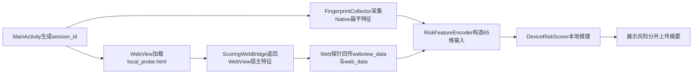

# 第3章 关键模块设计与实现

本章结合HybridGuard项目代码，说明三端设备指纹采集、后端会话合并、规则标注、样本生成、轻量评分器训练和App端侧评分闭环的实现方式。项目中保留了两条客户端链路：旧`:app`模块用于三端采集并上报后端，新的`:riskapp`模块用于在App内完成本地采集、特征编码和随机森林评分。两条链路共用同一套三端特征思想，但承担的工程角色不同。

## 3.1跨端设备指纹采集模块设计与实现

### 3.1.1 Android Native原生特征采集

旧采集App的原生特征入口位于`android_app/HybridGuard/app/src/main/java/com/example/hybridguard/MainActivity.kt`。App启动后生成UUID形式的`sessionId`，随后在后台线程中执行`collectAndSendNativeData()`，避免网络请求阻塞主线程。该函数将Android原生特征组织为`android_native_data`，并通过OkHttp以JSON形式POST到后端`/api/collect/fingerprint`接口。

Native侧特征采用分层JSON结构，主要包括六类。

| 子层级 | 主要字段 | 实现依据 |
|---|---|---|
| 构建指纹层 | `device_model`、`device_brand`、`os_version`、`os_api_level`、`cpu_abi`、`build_fingerprint`、`build_tags`、`uptime_ms` | `Build`与`SystemClock` |
| 内存层 | `total_memory_gb`、`avail_memory_gb`、`is_low_memory` | `ActivityManager.MemoryInfo` |
| 物理屏幕层 | `screen_resolution_physical`、`screen_density_dpi`、`screen_xdpi`、`screen_ydpi`、`screen_scaled_density` | `resources.displayMetrics` |
| 电池动态层 | `battery_level_pct`、`battery_temp_celsius`、`battery_voltage_mv`、`is_charging` | `ACTION_BATTERY_CHANGED` |
| 传感器矩阵层 | `sensor_total_count`、陀螺仪、加速度计、磁力计、光线、距离、气压传感器存在性 | `SensorManager` |
| 安全配置层 | `is_adb_enabled` | `Settings.Global.ADB_ENABLED` |

这种分层结构的作用是让后端能够保留原始语义边界：构建指纹用于描述设备身份，屏幕和电池用于描述物理环境，传感器矩阵用于辅助识别模拟器或低质量虚拟环境，安全配置用于观察调试状态。后续训练和端侧评分时，系统再将这些嵌套字段展平为模型输入。

### 3.1.2 WebView宿主容器特征采集

WebView宿主特征由`WebAppInterface.kt`提供。`MainActivity`在WebView中开启JavaScript，并通过`addJavascriptInterface(WebAppInterface(this, sessionId), "AndroidBridge")`注入桥接对象。前端页面可以调用`AndroidBridge.getSessionId()`获取与Native层一致的会话标识，也可以调用`AndroidBridge.getWebViewSecurityFeatures()`获取宿主容器特征。由于JSBridge是Web与Native之间的安全边界，Android官方文档也提示native bridge需要谨慎使用 **【引用：H05】**，本文在系统中同时将其作为能力通道和宿主真实性信号。

`getWebViewSecurityFeatures()`返回的内容包括宿主调试状态、包名、安装来源、WebView provider包名与版本、默认原生User-Agent、明文流量配置、首次安装时间、最后更新时间、target SDK、min SDK和系统HTTP agent。前端探针收到该JSON后，将其整理为`webview_data`的四个子层：通信桥接层、内核容器层、宿主安全层、时间与编译层。若桥接调用异常，还会记录异常信息。

该模块的关键意义在于补齐Native与Web之间的中间层。正常Hybrid App中，Web页面应能通过JSBridge获得宿主信息，并且WebView provider、系统UA和Web前端UA应存在版本呼应。如果页面缺少桥接对象，或宿主信息与Web层暴露信息明显不一致，就可能说明请求并非来自预期App容器。

### 3.1.3 Web前端运行环境特征采集

Web前端探针位于`backend_server/index.html`。旧采集链路中，Android App加载后端托管页面，页面在`window.onload`后执行`collectAndSend()`。探针首先尝试与`AndroidBridge`建立连接，记录`jsbridge_injected`和`bridge_latency_ms`；若桥接不存在，则生成`fallback-web-`开头的临时会话标识，并将桥接缺失作为高风险线索保留。

Web层采集内容包括四类：一是Navigator环境，例如`user_agent`、`language`、`platform`、`hardware_concurrency`、`device_memory`和`max_touch_points`；二是屏幕显示环境，例如逻辑分辨率、DPR、色深和可用宽高；三是图形渲染环境，例如WebGL vendor、renderer、扩展数量和Canvas哈希；四是执行环境，例如CPU算力挑战耗时和时区偏移。Canvas哈希通过页面绘制固定文本和图形后计算SHA-256得到，算力挑战则通过循环执行三角函数计算得到耗时。

最终，前端将`webview_data`和`web_data`组合成JSON，通过`fetch('/api/collect/fingerprint')`上传后端。这样，旧采集链路中Native数据和Web/WebView数据虽然分两次异步上报，但都使用同一`session_id`进行会话合并。

### 3.1.4端侧评分App中的本地采集

新`:riskapp`模块将采集和评分闭环迁移到App本地。其入口为`android_app/HybridGuard/riskapp/src/main/java/com/example/hybridguard/riskapp/MainActivity.kt`。App启动后生成`sessionId`，调用`FingerprintCollector.collectNativeFlat()`直接采集展平后的Native特征，然后加载本地资源`file:///android_asset/local_probe.html`，不再依赖后端托管探针页面。

本地Web探针通过`ScoringWebBridge`与Android端通信。该桥接对象提供四个能力：`getSessionId()`返回会话标识，`getWebViewSecurityFeatures()`返回WebView宿主特征，`sha256()`为Canvas数据提供端侧哈希能力，`submitWebPayload()`将Web/WebView payload回传给Kotlin层。`local_probe.html`的采集字段与旧探针基本一致，但数据不再直接上传后端，而是交给Android本地评分流程。

## 3.2后端数据接收、合并与持久化模块

后端服务位于`backend_server/main.py`，使用FastAPI实现。服务提供三个主要入口：根路径`/`用于托管前端探针页面，`/api/collect/fingerprint`用于接收三端原始指纹数据，`/api/risk/local-score`用于接收新评分App上传的端侧评分摘要。此外，`/health`用于健康检查。后端开启了CORS，便于本地测试和WebView页面上报。

### 3.2.1 Pydantic数据模型

后端使用Pydantic模型定义三端数据结构。`AndroidNativeData`对应Native六个子层，`WebViewData`对应桥接、内核、宿主安全、时间编译和异常层，`WebData`对应Navigator、屏幕、图形和执行层。总载荷`FingerprintPayload`包含`session_id`、`timestamp`、`client_ip`以及三个可选数据块。由于Native与Web/WebView分次上报，三个数据块均允许为空，由后端负责合并。

端侧评分摘要使用单独的`LocalRiskScorePayload`。该模型只包含`session_id`、`timestamp`、`risk_score`、`risk_level`、`risk_reason`、`scoring_engine`和`feature_count`，不接收三端原始指纹数据。这一点与端侧数据最小化目标一致：评分App本地完成推理后，只把结果摘要传回服务端。

### 3.2.2会话合并策略

后端使用内存字典`sessions_db`暂存会话，并在启动时尝试从`merged_sessions.json`恢复历史数据。当`/api/collect/fingerprint`收到请求时，后端先检查`session_id`是否已存在；若不存在，则初始化一条包含Native、WebView、Web三个空槽位的记录；若已存在，则认为这是同一会话的补充数据。

合并时，代码使用`payload.dict(exclude_unset=True, exclude_none=True)`提取本次请求真正携带的非空字段，只覆盖对应数据块，不会用空值擦除已有内容。这样可以支持Native先上报、Web后上报，或者Web先到达、Native后到达的异步情况。合并后的完整嵌套会话会写回`merged_sessions.json`，便于后续回溯。

### 3.2.3训练数据展开

为了便于大模型标注和机器学习训练，后端在会话具备Native和Web数据后，会生成一份扁平化版本追加到`collected_data.jsonl`。代码分别遍历`android_native_data`、`webview_data`和`web_data`的子层，将内部字段合并到单层字典中。这样，训练脚本可以直接使用`pandas.json_normalize`展开数据，而不必在每次训练时重复处理多层嵌套结构。

需要注意的是，`merged_sessions.json`保留的是原始嵌套结构，适合审计和解释；`collected_data.jsonl`保存的是面向标注和训练的扁平结构，适合批处理。两者服务于不同阶段，避免了“只保留训练表而丢失原始语义”的问题。

## 3.3跨层语义规则知识库与风险标签生成模块

### 3.3.1规则知识库构建思路

HybridGuard的风险判断不应只依赖单个字段阈值，也不应只依赖模型对原始字段的黑盒拟合。本文将规则知识库设计为系统中的独立语义层，用于沉淀“什么样的设备环境是可信的”“什么样的跨层矛盾值得警惕”“哪些异常组合更可能对应模拟器、云机房、无头浏览器或接口重放”等风控经验。规则知识库既服务于离线风险标签生成，也服务于后续一致性特征构造和端侧轻量评分器训练，是本文区别于普通字段采集系统的重要组成部分。

规则知识库的内容可以分为三类。第一类是跨层语义对齐规则，关注Native、WebView和Web三端之间是否相互呼应。例如Native物理屏幕与Web逻辑屏幕和DPR是否近似对应，Native设备型号和系统版本是否能在Web UA中得到印证，WebView provider版本是否与Web UA中的Chrome/WebView主版本一致，JSBridge返回的会话标识是否与Native层保持一致。这类规则用于发现“同一会话中不同层级不像来自同一设备或同一宿主”的问题。

第二类是风险场景判定规则，关注单端异常和多字段组合异常。例如传感器数量极少、关键传感器缺失、电池温度长期为固定值、WebGL renderer出现SwiftShader或Headless相关特征、`platform`暴露PC环境、`user_agent`变成`python-requests`、安装来源为`manual`且伴随ADB开启或时区异常、满电且长期接电等。这类规则不一定都表现为三端字段互相矛盾，但它们能够表达移动端风控中常见的攻击和测试机房特征。

第三类是容错规则，约束大模型不要把开发阶段和真实移动端差异误判为攻击。例如WebView可用高度会受到状态栏、导航栏和安全区影响，Web `deviceMemory`本身是粗粒度近似值，Chrome/WebView小版本可能因系统更新存在差异，开发灰度阶段的ADB、debuggable和cleartext配置也不应单独构成高危。容错规则的作用是让知识库既能识别攻击特征，又能减少对真实设备和开发样本的误伤。

规则知识库采用大模型辅助归纳与人工筛选结合的方式构建：先向大模型输入三端字段字典、典型正常样本、典型攻击样本、攻击样本生成模板以及人工确认的风险解释，再由大模型归纳候选规则；随后对候选规则进行去重、合并、阈值修正和优先级整理，形成可解释的规则条目。工程上，本文将规则知识库同时保存为`scoring/rule_knowledge_base.md`和`scoring/rule_knowledge_base.json`。前者用于论文说明和人工审阅，后者用于批量评分脚本读取。每条结构化规则包含规则编号、规则类别、关联字段、触发条件、风险等级、建议分数区间、是否一票否决、容错说明和解释模板，从而使规则库具备扩展、审计和版本管理能力。

### 3.3.2大模型辅助风险评分流程

大模型辅助评分流程的目标不是让模型凭空给分，而是让模型在规则知识库约束下，对三端指纹样本进行可解释的风险判断。流程上，系统先将采集到的Native、WebView和Web数据整理为统一JSON，再将规则知识库中的核心规则、优先级和容错说明提供给大模型，要求模型按照规则逐项分析样本，最终输出`risk_score`和`risk_reason`。其中`risk_score`用于后续训练轻量评分器，`risk_reason`用于保留样本的风险解释。

项目中包含两个相关脚本。`backend_server/rba_engine.py`更偏交互式分析，调用本地LM Studio的OpenAI-compatible API，并使用流式输出展示分析过程。它的提示词强调跨层交叉验证，包括物理生态链路、渲染与算力对齐、屏幕和UA撕裂、JSBridge存活等维度，适合用来观察单条样本的推理过程。

批量标注主要由`scoring/sorting_rule_kb.py`完成。该脚本同样连接本地LM Studio服务，但关闭流式输出以提高批处理效率。与交互式分析脚本不同，批量标注脚本会先读取`scoring/rule_knowledge_base.json`，将规则库中的评分区间、一票否决规则、跨层一致性规则、攻击场景规则和容错规则统一放入system prompt，再把单条三端指纹样本作为user prompt输入大模型。模型需要先按照规则编号分析命中情况，再输出严格JSON格式的`risk_score`和`risk_reason`。

这种做法使大模型的作用从“自由判断”变成“在规则知识库约束下进行可解释匹配”。例如传感器数量过少或JSBridge缺失会触发一票否决；`manual`安装、ADB、UTC时区和满电组合会被解释为云机房或测试机架；型号、系统版本、屏幕/DPR、CPU/platform、硬件/GPU、WebView provider和UA主版本用于判断三端是否自洽；而屏幕高度误差、内存粗粒度差异、开发阶段调试配置和Chrome小版本差异则被纳入容错说明。最终得到的离线风险分既保留了大模型的语义归纳能力，又受到结构化规则库约束，便于后续用轻量模型学习和压缩。

### 3.3.3标签质量控制

批量标注脚本在工程上做了几项容错处理。第一，输出文件存在时先读取已处理过的`session_id`，实现断点续传，避免批处理中断后重复标注。第二，模型输出可能包含草稿、思考内容或格式噪声，脚本会优先提取包含`risk_score`和`risk_reason`的JSON对象，并对部分中文符号和转义字符做修正。第三，标注结果并不覆盖原始样本，而是追加到`llm_label`字段中，保留原始三端指纹和风险标签的对应关系。

本文中大模型的作用是辅助生成离线风险标签，而不是在App运行时在线决策。这样既能利用大模型对跨层语义关系的解释能力，也避免端侧实时风控依赖大模型服务带来的成本、延迟和稳定性问题 **【引用：L01】**。

### 3.3.4规则示例

表3-1给出本文系统中具有代表性的规则类型。表中既包括跨层一致性规则，也包括风险场景判定规则和容错规则。

| 规则类别 | 关联特征层 | 规则含义 | 风险解释 |
|---|---|---|---|
| 屏幕一致性 | Native屏幕 + Web屏幕 | `逻辑分辨率x DPR`应近似对应物理分辨率 | 偏差过大可能说明Web环境被伪造或脱离宿主 |
| UA一致性 | Native Build + WebView UA + Web UA | 系统版本、机型和内核版本应相互呼应 | 不一致可能说明UA被改写或请求被重放 |
| 宿主真实性 | JSBridge + session_id | Web页面应能通过JSBridge获取同一会话 | JSBridge缺失可能说明外部浏览器或脚本绕过App |
| 物理可信性 | 传感器 + 电池 | 真机通常具备合理传感器矩阵和动态电池状态 | 传感器极少或电池死值可能说明模拟器 |
| 渲染环境 | WebGL + Native硬件 | GPU renderer应符合移动端硬件生态 | SwiftShader、Headless、PC GPU属于高风险线索 |
| 云机房/调试环境 | 安装来源 + ADB + 电池 + 时区 | manual安装、ADB开启、满电接线、异常时区组合出现时提高风险 | 可能对应云真机、测试机架或群控设备 |
| 自动化/重放 | Native缺失 + JSBridge缺失 + UA | Native字段为空、桥接缺失、UA为脚本客户端时判为高危 | 可能是接口重放或脱离App宿主的自动化请求 |
| 容错规则 | 开发配置 + 设备差异 | ADB/debuggable、屏幕高度误差、内存波动不应单独高危 | 避免把开发阶段或真实设备差异误判为攻击 |

## 3.4数据集构建与样本生成模块

### 3.4.1真实设备数据采集

真实样本主要来自旧采集App在Android真机和云真机环境中的运行结果。旧`:app`模块加载后端探针页，Native与Web/WebView分别上报后由后端合并。仓库中`scoring/real_data.jsonl`当前包含84条真实采集样本。项目还包含`run_browserstack.py`，用于通过Appium和BrowserStack云真机批量启动App并等待探针静默上报。论文中只描述该采集方式，不写入账号、密钥、临时URL等敏感配置。

### 3.4.2真实样本扩充

`scoring/augment_device_data.py`用于对真实样本进行扩充，默认目标数量为300条。脚本保留设备型号、系统版本、屏幕、传感器等相对静态特征，同时扰动时间戳、`session_id`、开机时间、可用内存、电池电量、电池温度、充电状态、JSBridge延迟和算力挑战耗时等动态特征。这样可以模拟同一真实设备在不同时间运行时产生的自然波动，避免模型只记住少量固定样本。

### 3.4.3高危样本生成

`scoring/generate_bad_data.py`用于生成300条高危模拟样本，覆盖三类攻击模板。第一类是API重放，将Native字段置空，关闭JSBridge，并使用`python-requests`形式的UA，模拟脱离App宿主的接口请求。第二类是无头PC浏览器，将设备模型伪造成Windows PC，传感器置为缺失，平台设置为`Win32`，UA使用HeadlessChrome，并将算力耗时设置得异常偏快。第三类是廉价模拟器，使用`goldfish`、`ranchu`、`x86`、`Google SwiftShader`、UTC时区和极少传感器等典型模拟器特征。

### 3.4.4当前数据规模

当前仓库中的主要数据文件如表3-2所示。

| 文件 | 当前行数 | 用途 |
|---|---:|---|
| `scoring/real_data.jsonl` | 84 | 真实采集样本 |
| `scoring/real_data_augmented.jsonl` | 300 | 真实样本扩充结果 |
| `scoring/simulated_bad_data.jsonl` | 300 | 高危模拟样本 |
| `backend_server/collected_data.jsonl` | 808 | 后端采集链路追加的训练候选数据 |
| `training/scored_data.jsonl` | 1323 | 带`llm_label`的训练与实验数据 |
| `backend_server/local_score_results.jsonl` | 2 | 端侧评分App上传的评分摘要样例 |

其中`training/scored_data.jsonl`是轻量评分器和消融实验使用的主要数据文件。后续论文定稿时，如果继续补充真机样本或端侧评分结果，应以最终清洗后的统计表为准。

## 3.5轻量风险评分模块

### 3.5.1特征工程

轻量评分器训练脚本位于`training/`目录。`train_randomforest.py`读取`scored_data.jsonl`，使用`pandas.json_normalize`展开嵌套JSON，并以`llm_label.risk_score`作为回归目标。训练输入会剔除`session_id`、`timestamp`、`client_ip`、`llm_label.risk_score`和`llm_label.risk_reason`等非输入字段。对字符串和布尔字段，脚本使用`LabelEncoder`编码，并将缺失值填为`"Unknown"`；对数值字段，缺失值填为`-1`。

神经网络对照脚本`train_mlp.py`采用另一套预处理方式：删除`build_fingerprint`、`user_agent`和`canvas_hash`等高维复杂文本字段，对类别特征做独热编码，对数值特征用中位数填补并使用`StandardScaler`标准化。两种脚本使用相同的`train_test_split(test_size=0.2, random_state=42)`，便于在相近划分下比较工程效果。

### 3.5.2候选评分器实现

随机森林脚本使用`RandomForestRegressor(n_estimators=50, max_depth=10, random_state=42)`。限制树深度的原因是控制生成Java代码的体积，避免端侧编译和运行开销过大。训练完成后，脚本使用`m2cgen`将模型导出为`DeviceRiskScorer.java`，并生成`tree_test_predictions_results.csv`供误差分析。

MLP脚本定义了一个浅层网络`ShallowRiskNet`，结构为`input -> 64 -> 32 -> 1`，中间使用ReLU和Dropout，损失函数为MSE，优化器为Adam，训练150个epoch。训练结束后保存`shallow_risk_net.pth`和`feature_scaler.pkl`。该模型作为随机森林的工程对照，用于验证结构化三端指纹能否被轻量模型拟合，但并不是本文的算法创新点。

### 3.5.3随机森林端侧部署原因

本文最终选择随机森林作为端侧评分器，主要是工程原因。三端设备指纹属于小样本、结构化、混合数值与类别特征的数据，随机森林对这类数据较稳定，训练和部署成本较低；m2cgen可以直接生成Java推理代码，便于集成到Android工程；同时，树模型特征重要性和分裂路径也更容易用于解释风险判断。端侧模型需要兼顾推理速度、资源占用和可维护性，轻量化部署比复杂模型结构更符合本文系统目标 **【引用：E01】【引用：R12】**。

## 3.6 App本地评分模块设计与实现

### 3.6.1端侧模块结构

新评分App位于`android_app/HybridGuard/riskapp/`。其`build.gradle.kts`中设置`minSdk=30`、`targetSdk=36`，依赖AppCompat、Material和OkHttp。该模块的核心文件包括`MainActivity.kt`、`FingerprintCollector.kt`、`ScoringWebBridge.kt`、`RiskFeatureEncoder.java`、`DeviceRiskScorer.java`和`assets/local_probe.html`。Android官方文档对WebView本地内容加载、资源组织和安全加载方式给出了专门说明，这为端侧本地探针页面的工程实现提供了参考 **【引用：H08】**。

端侧评分流程如下。

### 3.6.2端侧特征编码

`RiskFeatureEncoder.java`是端侧特征适配器，固化了训练阶段`pandas.json_normalize`后的65维字段顺序。字段覆盖Native 33维、WebView 14维和Web 18维。编码器内部维护每个类别字段的取值列表，布尔值转为`"True"`或`"False"`后参与类别编码，缺失类别优先映射为`"Unknown"`，无法识别时返回`-1.0`；数值字段直接转为`double`，缺失或解析失败时返回`-1.0`。

这一层是端侧评分闭环中最关键的工程约束。训练阶段的列顺序、类别编码和缺失值策略必须与Android端完全一致，否则`DeviceRiskScorer`得到的输入语义会错位。项目通过将65维字段顺序和类别表固化进Java类，避免运行时依赖Python预处理环境。

### 3.6.3本地随机森林推理与结果上报

`MainActivity.kt`在收到`local_probe.html`通过`submitWebPayload()`回传的Web/WebView数据后，先使用`FingerprintCollector.flattenLayers()`将嵌套数据展平，再构造包含`session_id`、`timestamp`、`android_native_data`、`webview_data`和`web_data`的评分会话。随后调用`RiskFeatureEncoder.encode(scoringSession)`生成输入向量，并调用`DeviceRiskScorer.score(features)`得到风险分。输出分数被限制在0到100之间。

风险等级采用简单阈值：分数大于等于80为high，大于等于50为medium，其余为low。App会在界面上展示本地评分结果，并向`/api/risk/local-score`上传评分摘要。上传字段包括`session_id`、`timestamp`、`risk_score`、`risk_level`、`risk_reason`、`scoring_engine=random_forest_m2cgen`和`feature_count`。该接口不上传原始三端指纹，体现了端侧闭环和数据最小化设计。

### 3.6.4工程风险与处理

端侧评分实现中最主要的风险是训练侧和端侧特征不一致。项目通过`RiskFeatureEncoder`固化字段顺序、类别编码和缺失值策略来降低该风险。第二个风险是WebView采集异步完成前就触发评分。当前实现由`local_probe.html`采集完成后主动调用`submitWebPayload()`，Android端收到完整payload后才执行评分。第三个风险是端侧生成的Java模型代码较大，因此训练脚本限制随机森林深度，以控制Android编译和运行成本。

## 3.7本章小结

本章基于项目实际代码介绍了HybridGuard的关键模块实现。旧`:app`模块负责三端原始指纹采集和后端上报，`backend_server/main.py`负责Pydantic校验、会话合并、原始数据持久化和训练数据展开；`scoring/`目录完成真实样本扩充、高危样本生成和大模型离线标注；`training/`目录完成随机森林和MLP评分器训练，并通过m2cgen导出Java推理代码；新`:riskapp`模块则完成本地三端采集、65维特征编码、随机森林推理和评分摘要上报。整体来看，本文的实现重点是把三端采集、跨层语义规则和端侧轻量评分串成闭环，而不是提出新的机器学习算法。
