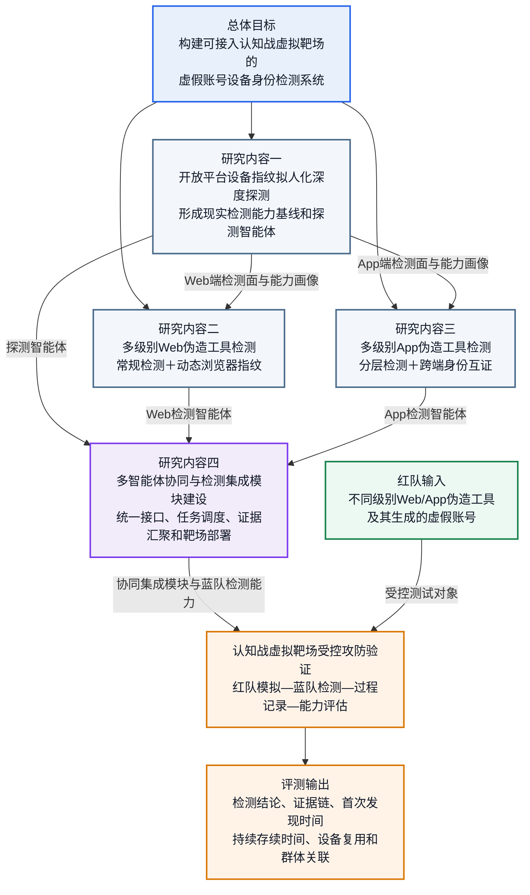

# 面向虚假账号检测的交互安全系统建模

## 总体研究内容结构图

图中研究内容一、二、三分别形成三个专业智能体，研究内容四负责将三个智能体统一封装、协同调度并接入认知战虚拟靶场。研究内容四属于工程化集成研究内容，不另设第四个技术子目标、第四项关键技术或第四项创新点。

> 当前状态：结构母版  
> 填写方式：严格按照既定目录逐节填充，未经确认不调整一级、二级标题。

## 内部编写总说明（分工与80页控制，正式定稿时删除）

### 1. 全本统一逻辑

全本统一按照“现实需求与能力缺口—总体目标与三个技术子目标—四项研究内容—三项关键技术—三项创新点—三条专业技术路线—三个专业智能体—一个协同集成模块—四项成果考核”的链条展开。研究内容一、二、三分别与三个技术子目标、三项关键技术、三项创新点和三个专业智能体严格对应；研究内容四对应协同集成模块及靶场部署，不另设第四个技术子目标、第四项关键技术或第四项创新点。

本项目的中心定位必须始终保持一致：项目不建设完整的认知战虚拟靶场，而是建设可接入认知战虚拟靶场的虚假账号设备身份检测系统，在靶场中承担蓝队检测角色，用于检验红队虚假账号的设备身份伪装、检测规避和持续存续能力。

### 2. 80页总体篇幅分配

建议最终成册按80页控制，包含封面、目录、正文、图表和参考文献，不包含证明材料等附件。本说明属于内部协作材料，不计入80页，正式定稿时删除。按每页约600—800字并配置必要图表估算，正文建议控制在4.3万—5.5万字；具体以最终模板字号、行距和图表密度为准。

| 部分 | 建议页数 | 建议字数 | 具体分配 | 写作重点 |
|---|---:|---:|---|---|
| 封面、目录和缩略语 | 3页 | 不计正文 | 封面1页，目录及缩略语2页 | 保证项目名称、成果名称和术语统一 |
| 一、立项的必要性 | 15页 | 9000—11000字 | 研究目的和意义3页；国内外现状分析9页；需求分析3页 | 回答“为什么必须做”，现状分析围绕前三项技术研究内容展开 |
| 二、研究目标和技术指标 | 6页 | 3500—4500字 | 研究目标3页；技术指标3页 | 回答“要解决什么问题、形成什么成果、达到什么程度” |
| 三、研究内容和关键技术 | 33页 | 20500—24500字 | 研究内容25页；关键技术5页；创新点3页 | 全本篇幅重点，突出工具分类分级、作用机理、检测证据分析及协同集成 |
| 四、技术方案 | 16页 | 8500—11500字 | 总体技术方案7页；技术难点和解决途径4页；工程化方案3页；科学数据管理计划2页 | 回答“四项研究如何实施、三个智能体如何集成并接入靶场” |
| 五、考核方式 | 5页 | 3000—4000字 | 通用考核说明0.5页；三个智能体各1页；集成模块1页；综合验收0.5页 | 与第二章四项技术指标逐项对应 |
| 参考文献 | 2页 | 不计正文 | 国内外权威文献、标准、公开技术资料 | 所有现状判断和技术路线依据均应可核验 |
| **合计** | **80页** | **约4.45万—5.55万字** |  |  |

各二级章节的交稿字数建议如下，负责人可在区间内根据图表数量调节。图表较多时采用下限，纯文字较多时采用上限。

| 二级章节 | 建议页数 | 建议字数 | 小框架 |
|---|---:|---:|---|
| 一（一）研究目的和意义 | 3页 | 1800—2200字 | 国家安全与认知域背景—靶场缺少蓝队设备身份检测—项目目的—国防、技术和自主创新意义 |
| 一（二）国内外现状分析 | 9页 | 5400—6800字 | 总体态势简述—开放平台探测现状—Web检测现状—App与跨端检测现状—国内外差距与项目切入点 |
| 一（三）需求分析 | 3页 | 1800—2200字 | 现实威胁需求—靶场验证需求—设备身份检测需求—系统集成和自主可控需求 |
| 二（一）研究目标 | 3页 | 1800—2200字 | 一个总体目标—三个子目标—应用对象与领域 |
| 二（二）技术指标 | 3页 | 1700—2300字 | 三个智能体和一个集成模块的数量、功能、性能与应用效能指标 |
| 三（一）研究内容 | 25页 | 16500—19900字 | 前三项分别写技术研究和智能体成果，第四项写协同集成与靶场部署，重点扩写Web/App工具分析 |
| 三（二）关键技术 | 5页 | 3200—4000字 | 每项按核心矛盾—需要突破的机制—实现路径—自主可控要求撰写 |
| 三（三）创新点 | 3页 | 1800—2400字 | 每项按现有局限—新机制—新能力—预期提升撰写 |
| 四（一）总体技术方案 | 7页 | 4000—5000字 | 总体思路—系统架构—三条专业技术路线—研究内容四的协同集成与靶场闭环 |
| 四（二）技术难点和解决途径 | 4页 | 2200—3000字 | 三类技术难点分别写表现、原因、影响、解决方法、备选方案和验证方法 |
| 四（三）工程化方案 | 3页 | 1700—2200字 | 三个智能体封装—集成模块—靶场部署—研发测试与交付 |
| 四（四）科学数据管理计划 | 2页 | 1000—1500字 | 数据类型—标准—质量—存储与版本—权限安全—共享归档 |
| 五、考核方式 | 5页 | 3000—4000字 | 四项成果逐项考核—统一环境和指标口径—综合验收 |

第三章“研究内容”25页建议进一步分配如下。

| 研究内容 | 建议页数 | 建议字数 | 小节页数与字数建议 | 特别要求 |
|---|---:|---:|---|---|
| 研究内容一：开放平台设备指纹拟人化深度探测智能体 | 7页 | 4500—5500字 | 研究问题与对象500字；拟人交互1200—1500字；采集链路探测1600—1900字；策略变化与画像800—1000字；本项小结及输出400—600字 | 重点写平台可能采集什么、在何种交互下触发、如何从接口调用和数据流还原检测能力 |
| 研究内容二：多级别Web伪造工具检测智能体 | 8页 | 5500—6500字 | 研究问题与对象500字；工具分类分级2000—2400字；常规检测700—900字；动态浏览器指纹1500—1800字；证据融合与智能体800—900字 | 工具分析可展开写，说明各级工具修改对象、作用层次、能力边界、可观测痕迹和对应检测手段 |
| 研究内容三：多级别App伪造工具检测智能体 | 8页 | 5500—6500字 | 研究问题与对象500字；工具分类分级2000—2400字；常规分层检测700—900字；跨端互证1500—1800字；证据融合与智能体800—900字 | 工具分析可展开写，突出设备标识修改、模拟器、云手机、虚拟化、多开、Root、Hook等不同层级 |
| 研究内容四：多智能体协同与检测集成模块建设 | 2页 | 1000—1400字 | 建设目标200字；统一接口和数据规范300—400字；任务调度与证据汇聚300—400字；靶场部署与评测输出200—400字 | 重点写前三个智能体怎样组合成系统，不重复前三项算法，不另凝练关键技术和创新点 |
| **合计** | **25页** | **16500—19900字** |  | Web和App工具分类分级及作用机理分析合计建议4000—4800字，是研究内容部分的重点材料 |

第三章其余8页建议分配为：三项关键技术分别1.5页、1.75页和1.75页，共5页；三项创新点各1页，共3页。第四章16页建议分配为：总体设计1页、总体架构1.25页、技术路线一1页、技术路线二1.25页、技术路线三1.25页、多智能体协同闭环1.25页；三类技术难点分别1.25页、1.375页和1.375页；三个智能体工程化封装1.25页、集成模块0.75页、靶场部署0.5页、研发交付流程0.5页；科学数据管理2页。

研究目标--》子目标--》研究内容---》 创新点 总图 （余玥） 1个
技术线路总图  （余玥） 1个
研究内容图 （文晶，依林，梁骁，子薇） 4个
关键技术 （文晶，依林，梁骁） 3个
工程架构图  （余玥，兆丰，子薇）  1个
超级链接 图加上 超级链接 

### 3. 全本一一对应关系

| 逻辑环节 | 工作包一 | 工作包二 | 工作包三 | 工程化工作包 |
|---|---|---|---|---|
| 现状分析 | 开放平台设备指纹探测与检测能力画像 | Web端静动态协同设备身份检测 | App端设备身份与跨端互证 | 国内外能力多为单点工具，缺少靶场化系统集成 |
| 子目标 | 常态化、自动化、拟人化深度探测 | 多级别Web伪造工具静动态协同检测 | 多级别App伪造工具分层与跨端联合检测 | 服务总体目标，不另设子目标 |
| 研究内容 | 研究内容一：开放平台设备指纹拟人化深度探测智能体研究 | 研究内容二：多级别Web伪造工具检测智能体研究 | 研究内容三：多级别App伪造工具检测智能体研究 | 研究内容四：多智能体协同与检测集成模块建设 |
| 关键技术 | 拟人交互与采集链路深度探测 | 静态一致性与动态浏览器指纹协同检测 | 分层检测与跨端身份互证 | 采用统一接口、任务编排和证据汇聚实现工程集成 |
| 创新点 | 常态化、自动化、拟人互动式深度探测 | 动态浏览器指纹增强检测 | 跨端身份互证增强检测 | 不把“集成”包装为科学创新 |
| 技术路线 | 技术路线一 | 技术路线二 | 技术路线三 | 多智能体协同与靶场验证闭环 |
| 软件成果 | 拟人化深度探测智能体1个 | Web伪造工具检测智能体1个 | App伪造工具检测智能体1个 | 协同集成模块1个 |
| 技术指标编号 | 指标1 | 指标2 | 指标3 | 指标4 |
| 考核编号 | 考核1 | 考核2 | 考核3 | 考核4 |

### 4. 工作包边界、关联和分工

#### 4.1 工作包一：开放平台设备指纹拟人化深度探测

本工作包负责回答“现实开放平台可能采集哪些设备身份数据、在何种交互条件下触发、可形成何种检测能力”。负责人重点提交平台交互场景、采集字段与接口、触发时序、采集链路、检测能力画像及变化发现方法，不负责重复论述Web或App伪造工具的具体检测算法。其输出的设备指纹采集面、证据字段、触发条件和检测强度分级，是工作包二、工作包三设计检测特征的现实依据，也是工程化工作包配置靶场检测策略的输入。

#### 4.2 工作包二：多级别Web伪造工具检测

本工作包负责回答“不同级别Web伪造工具改变了什么、留下什么痕迹、如何通过常规证据和动态浏览器指纹加以识别”。负责人重点提交工具谱系、分类分级依据、各级工具的作用对象与能力边界、可观测证据、常规检测方法、动态挑战与响应机制、证据融合及智能体接口，不重复撰写开放平台采集行为综述，也不扩展到App端Native和跨端身份检测。其输入包括工作包一给出的Web采集面和检测能力画像，其输出包括工具级别、设备身份风险、检测证据链和跨会话关联结果，交由集成模块汇聚。

#### 4.3 工作包三：多级别App伪造工具检测

本工作包负责回答“不同级别App伪造工具作用于哪个系统层次、如何形成身份伪装、如何通过端内分层证据和跨端身份互证加以识别”。负责人重点提交App工具谱系、分类分级依据、设备标识与环境修改机理、常规分层证据、Native/WebView/Web统一表示与冲突判据、证据融合及智能体接口，不重复撰写Web动态浏览器指纹算法。其输入包括工作包一给出的App端采集面和检测能力画像，其输出包括工具级别、设备环境真实性、跨端身份冲突和同源关联结果，交由集成模块汇聚。

#### 4.4 工程化工作包：多智能体协同与检测集成

本工作包对应研究内容四，负责回答“三个专业智能体如何统一封装、调度、部署、记录和验收”。负责人重点提交统一数据字典、接口规范、智能体注册与状态管理、任务编排、证据汇聚、过程记录、报告生成、靶场接口、部署拓扑和系统测试方案，不重新发明三个智能体内部算法，不将工程集成写成第四项关键技术或第四项创新点。其输入是三个智能体的标准化能力与结果，输出是靶场可调用的检测服务、全过程记录和虚假账号存续能力评测结果。

#### 4.5 总体组职责

总体组负责第一章、第二章和全本统稿，统一“开放平台、设备指纹、设备身份、伪造工具、动态浏览器指纹、跨端身份互证、虚假账号存续能力”等术语；检查三个工作包的目标、内容、关键技术、创新点、路线、指标和考核是否同名同序；检查工程化工作包是否越界；统一图号、表号、参考文献和量化口径。

### 5. 可贯穿全文的示例场景

以下案例用于帮助各负责人理解写法，正式成稿时应替换为经过授权、可复现的测试场景和真实数据，不写可直接用于绕过真实平台安全机制的操作步骤。

| 案例 | 场景描述 | 主要使用章节 | 体现的对应关系 |
|---|---|---|---|
| 案例A：多步骤业务触发下的设备指纹采集发现 | 探测智能体按照“注册—登录—浏览—互动—发布”等受控任务持续交互，对比不同动作前后的接口调用、SDK行为和网络数据流，形成采集链路和平台检测能力画像 | 现状分析1、研究内容1、关键技术1、技术路线1、考核1 | 说明为什么需要从固定脚本转向拟人化、常态化深度探测 |
| 案例B：不同级别Web伪造工具的检测对比 | 在同一受控业务流程下，分别加载自动化控制、属性修改、环境模拟和指纹复制类样本，比较静态属性一致性与随机动态挑战响应的检测效果 | 现状分析2、研究内容2、关键技术2、创新点2、考核2 | 说明常规检测覆盖中低级工具，动态浏览器指纹增强高级工具检测 |
| 案例C：App端多层伪装与跨端身份冲突 | 在受控Android环境中设置标识修改、多开、虚拟化或Hook样本，并比较Native、WebView和Web侧的设备身份特征，发现单端伪装造成的跨端冲突 | 现状分析3、研究内容3、关键技术3、创新点3、考核3 | 说明单端分层检测与跨端互证的互补关系 |
| 案例D：靶场虚假账号存续能力验证 | 红队虚假账号在Web端和App端执行受控任务，集成模块调度三个智能体，记录账号首次暴露、首次发现、持续活动时间、设备复用和群体关联结果 | 总体目标、总体技术方案、工程化方案、考核4 | 说明三个智能体如何通过集成模块形成“红队模拟—蓝队检测—过程记录—能力评估”闭环 |

# 一、立项的必要性

## （一）研究目的和意义（巫）

*从围绕支撑国家安全和国防建设，提升国防科技工业自主创新能力，国防科技工业长远发展的关键、基础、前沿技术问题等方面，具体阐述开展本项目研究的目的和意义。*

随着生成式人工智能、自动化交互和群体协同技术加速发展，虚假账号的生成与操控成本持续降低，其活动方式正由人工操控和简单脚本执行向智能生成、自动交互、多账号协同和多端身份伪装演进。虚假账号能够以低成本、规模化方式参与信息发布、关系构建和群体互动，已成为影响认知域安全的重要虚拟身份载体。面向国家安全和国防建设，构建能够在封闭、受控、可重复环境中模拟、检测和评估虚假账号活动的认知战虚拟靶场，是研究认知域对抗规律、验证相关技术能力和完善试验条件的重要基础。

认知战虚拟靶场不仅需要红队模拟虚假账号及其对抗活动，还需要配置与真实开放平台相近的检测方能力，才能对红队的身份伪装、检测规避和持续存续能力作出客观评价。设备身份连接物理或虚拟设备、客户端环境、登录会话、账号主体和交互行为，是识别批量控制、身份复用、设备伪装及同源账号群体的重要底层依据。缺少设备身份检测环节，红队账号即使在靶场中长期未被发现，也难以证明其能够对抗现实条件下的身份检测机制，靶场攻防结果的真实性和有效性将受到限制。

本项目旨在面向认知战虚拟靶场构建虚假账号设备身份检测能力，在靶场中承担检测方和防御方角色。项目通过探测典型开放平台在Web端和App端的设备指纹采集行为，形成具有现实依据的检测能力画像；研究Web端常规设备检测与动态执行验真方法，提升对指纹篡改、复制和重放等设备伪装行为的识别能力；研究App端设备身份检测与Native、WebView、Web跨端互证方法，提升对多端身份割裂和同源账号群体的关联能力；在此基础上，构建三个专业检测智能体和一个多智能体协同集成模块，形成可接入认知战虚拟靶场的虚假账号检测能力。

项目实施具有三方面意义：一是在国防应用层面，补齐认知战虚拟靶场中设备身份检测和蓝队验证能力，形成“红队模拟—蓝队检测—过程记录—能力评估”的攻防闭环，为虚假账号存续能力和对抗能力验证提供可信条件；二是在技术发展层面，推动虚假账号检测由内容、行为和关系表征向设备身份及多端交互证据延伸，促进开放平台检测能力画像、Web动态验真、App跨端互证和多智能体协同检测等关键技术发展；三是在自主创新层面，形成可控、可配置、可复现的虚假账号设备身份检测模块，为国防科技工业相关试验验证条件建设以及认知域安全能力长远发展提供自主技术储备。

## （二）国内外现状分析（余玥总排版）

*列出国内外发展现状和发展趋势，存在的主要问题和差距，本研究领域国内优势单位及研究进展。信息来源应翔实、权威、准确，分析归纳合理、清晰。*

【总体态势引导段】

本段用于概括面向虚假账号检测的设备身份攻防总体态势，不单独设置标题，重点说明：随着虚假账号攻击向自动化、规模化和多端设备伪装演进，国外围绕反检测浏览器、移动端环境伪装、设备指纹采集和风险识别等方向形成了较为活跃的工具生态、学术研究和产业实践，设备身份检测正由静态、单端向动态、跨端和多源协同方向发展。国内在浏览器指纹、移动安全、反爬虫、反欺诈和设备风险控制等方面已有一定应用基础，但相关能力多服务于具体业务并封装在企业系统内部，公开研究相对分散，在前沿方法、统一建模和系统集成方面仍显不足。基于上述态势，后续重点围绕开放平台检测能力画像、Web端静动态协同检测和App端跨端互证三个方向分析国内外进展与差距。

### 1. 开放平台设备指纹探测与检测能力画像研究现状（文晶，余玥）

#### 1.1 国外研究与应用进展

重点梳理：

1. 国外对Web页面、浏览器脚本、App及第三方SDK设备信息采集行为的测量研究。
2. 对设备属性、接口调用、采集路径、采集时序和数据流的分析方法。
3. 国外开放平台、安全厂商和研究机构在设备指纹、设备风险及虚假账号检测方面的公开实践。
4. 相关测量工具、数据集、代表性论文、专利、技术报告和产品能力。
5. 国外研究由采集字段发现向采集路径、特征组合和检测能力分析发展的趋势。

本部分需要回答：国外是否已经形成从设备指纹采集行为测量到平台检测能力分析的研究链条，以及相关能力发展到什么阶段。

#### 1.2 国内优势单位及研究进展

重点梳理：

1. 国内在浏览器指纹测量、App隐私行为检测、SDK分析和设备风险识别方面的研究基础。
2. 国内优势高校、科研院所、互联网平台和安全企业。
3. 各优势单位的代表性论文、专利、产品、平台或工程应用。
4. 国内相关技术主要应用于隐私合规、反欺诈、反爬虫、机器人检测还是设备身份识别。
5. 国内是否已经形成Web/App统一采集面分析和检测能力画像方法。

本部分应客观说明：国内工业界可能已经在具体业务中应用设备指纹和设备风险技术，但相关能力通常封装在企业内部系统中，公开资料有限；公开研究更多集中于单项采集行为、隐私合规或特定业务，尚未形成面向认知战虚拟靶场的统一检测能力画像体系。

#### 1.3 发展趋势、主要问题与国内外差距

重点归纳：

1. 从静态字段清单向采集路径、采集时序和特征组合分析发展。
2. 从Web或App单端测量向Web/App多端统一测绘发展。
3. 从隐私合规分析向安全检测能力画像发展。
4. 从观察平台“采集了什么”向分析平台“可能具备什么检测能力”发展。

拟形成的差距判断：国内已有相关测量和应用基础，但缺少面向虚假账号检测的Web/App设备指纹统一探测方法，也缺少区分可观测事实、能力推断与受控验证的系统化检测能力画像研究。

### 2. Web端静动态协同设备身份检测研究现状（浩杰，炜烨，依林）

#### 2.1 国外研究与应用进展

按照攻击侧和防御侧两个方面组织。

攻击侧重点梳理： （工具的能力，在这里面全部要讲明白，系统的分析，展示出我们对这块非常明确，每一个攻击工具的能力，每一个防御工具的能力写出来，带引用，github链接）

1. 自动化浏览器和反检测浏览器的发展。
2. 浏览器属性、Canvas、WebGL、Audio等设备指纹伪装能力。
3. 指纹复制、重放、预计算和完整浏览器环境复刻能力。
4. Web攻击工具由单字段修改向完整设备环境模拟的发展趋势。

防御侧重点梳理：（论文，blog）

1. 浏览器指纹唯一性、稳定性和持续关联研究。
2. 浏览器属性一致性、异常组合和自动化环境检测。
3. 指纹篡改、复制、重放和环境伪装检测。
4. 动态挑战、挑战响应、执行时序和CPU/GPU执行证据。
5. 国外开放平台、安全厂商和研究机构的代表性成果。

本部分需要回答：国外Web设备身份检测是否已经由静态指纹比对向动态挑战和当下执行真实性验证发展。

#### 2.2 国内优势单位及研究进展

重点梳理：

1. 国内浏览器指纹、反爬虫、机器人检测和Web自动化识别研究。
2. 浏览器环境一致性、异常属性组合和伪装环境检测。
3. 国内优势高校、科研院所、互联网平台和安全企业。
4. 各单位的代表性论文、专利、产品和工程应用。
5. 国内在动态挑战、执行真实性和静动态联合判定方面的公开进展。

本部分应客观说明：国内工业界在反爬虫、反欺诈和机器人检测中可能已经使用浏览器指纹与设备风险信号，但公开技术多面向具体业务，学术研究与产业能力之间缺少透明衔接，尚未形成可供虚拟靶场复现和配置的Web静动态协同检测体系。

#### 2.3 发展趋势、主要问题与国内外差距

重点归纳：

1. 从静态属性检测向静动态联合检测发展。
2. 从固定特征匹配向随机挑战响应发展。
3. 从判断结果真实性向验证当下执行真实性发展。
4. 从单次设备识别向账号—会话—设备持续关联发展。

拟形成的差距判断：国内已有Web设备识别、反爬虫和自动化检测基础，但公开研究仍以静态指纹、环境一致性和经验规则为主，面对指纹复制、重放及完整环境模拟工具，尚缺少融合常规检测、动态挑战与执行证据的系统化设备身份检测方法。

### 3. App端设备身份与跨端互证研究现状（涵宇）

#### 3.1 国外研究与应用进展

按照攻击侧和防御侧两个方面组织。

攻击侧重点梳理：

1. Android模拟器、云手机、虚拟化、容器和多开环境。
2. Root、Hook、运行环境修改和设备标识重置。
3. 批量设备环境生成与多账号控制。
4. Native、WebView和Web之间的差异化身份伪装。
5. App攻击工具由单设备伪装向规模化、多端协同伪装发展的趋势。

防御侧重点梳理：

1. App软硬件属性、设备标识和运行环境检测。
2. 模拟器、虚拟化、Root、Hook和完整性检测。
3. 设备证明、App实例与物理设备关联。
4. Native、WebView和Web之间的设备身份映射。
5. 多端身份一致性、异常冲突和同源设备识别。
6. 国外开放平台、安全厂商和研究机构的代表性成果。

本部分需要回答：国外App设备检测是否已经由单端环境识别向跨端身份映射和一致性互证发展。

#### 3.2 国内优势单位及研究进展

重点梳理：

1. 国内Android安全、移动设备指纹和移动反欺诈研究。
2. 模拟器、虚拟化、多开和异常运行环境检测。
3. App隐私行为和SDK数据采集分析。
4. 国内优势高校、科研院所、互联网平台和安全企业。
5. 各单位的代表性论文、专利、产品和工程应用。
6. 国内在Native、WebView和Web跨端身份互证方面的公开进展。

本部分应客观说明：国内工业界在移动反欺诈、设备风险和异常环境检测方面可能已经形成实际应用，但相关能力主要面向单一App或具体业务系统，公开研究在跨端设备身份统一建模、互证判定和同源账号关联方面仍不充分。

#### 3.3 发展趋势、主要问题与国内外差距

重点归纳：

1. 从设备标识判断向设备环境真实性检测发展。
2. 从单一App检测向Native、WebView和Web多端互证发展。
3. 从单账号设备判断向同源设备和同源账号群体关联发展。
4. 从单项风险特征向跨端证据融合发展。

拟形成的差距判断：国内现有App设备检测主要面向单一客户端和单一运行环境，缺少Native、WebView和Web之间的设备身份映射、一致性互证和同源账号关联能力，尚未形成面向认知战虚拟靶场的跨端设备身份检测体系。

【综合结论段】

本段用于收束三个研究方向，不单独设置标题。拟形成的总体判断是：国外在设备身份攻防工具、开放平台检测实践和相关前沿研究方面已形成较丰富积累，国内在浏览器指纹、移动安全、反爬虫、反欺诈和设备风险识别等单项方向具备一定基础，工业界也可能已形成面向具体业务的应用能力，但公开研究和技术成果总体较为分散，尚未形成覆盖开放平台检测能力画像、Web动态执行验真和App跨端身份互证的系统化、前沿化和集成化技术体系。面对认知战虚拟靶场红队仿真能力不断增强而蓝队设备身份检测条件相对不足的现实矛盾，有必要围绕上述三个方向开展系统研究。

## （三）需求分析（巫）

*分析项目紧迫、明确或潜在的需求。*

现有认知战虚拟靶场已能够由红队模拟虚假账号及其对抗活动，但与红队能力相匹配的蓝队设备身份检测条件仍不完善。红队能够在靶场中生成和操控虚假账号，开展身份伪装、多账号协同和持续活动等试验；然而，若靶场缺少接近真实开放平台水平的设备身份检测机制，就难以判断红队账号未被发现究竟源于其具备较强的检测规避能力，还是源于靶场检测条件不足。由此造成虚假账号存续时间、身份伪装效果和群体协同能力缺少可信评价基准，制约靶场攻防试验结果的真实性、可比性和可解释性。因此，补齐面向设备身份和设备伪装的蓝队检测能力，是当前认知战虚拟靶场建设中现实而紧迫的需求。

从检测基线构建看，靶场需要掌握典型开放平台在Web端和App端采集哪些设备身份信息、通过何种接口和时序完成采集、不同设备信号之间存在何种组合关系，并在区分可观测事实与能力推断的基础上，形成可配置、可更新、可验证的检测能力画像。该能力用于为靶场确定不同平台、不同场景和不同检测强度下的检测基线，使红队面对的检测环境具有现实依据，而不是由靶场建设人员凭经验设定。

从专业检测能力看，Web端需要具备浏览器指纹、环境一致性、自动化环境和异常属性组合等常规检测能力，同时需要引入动态挑战、执行响应和设备本征证据，判断设备身份信息是否由当前设备在当前会话中真实产生，提升对指纹篡改、复制、重放和预计算等伪装行为的识别能力。App端需要具备软硬件属性、运行环境、模拟器、虚拟化和设备标识异常等常规检测能力，同时需要建立Native、WebView和Web之间的身份映射与一致性互证机制，识别单端伪装、跨端身份冲突、设备复用以及同源账号群体。

从系统协同和靶场应用看，需要将开放平台设备指纹探测与能力画像、Web端静动态协同检测、App端设备身份与跨端互证检测分别封装为专业检测智能体，并建设多智能体协同集成模块，实现检测任务配置与分解、智能体调度、异构证据融合、账号—会话—设备关系构建、虚假账号判定和同源群体关联。系统应能够与认知战虚拟靶场的账号、设备、会话和任务系统进行标准化连接，支持检测策略和检测强度配置，完整记录虚假账号从进入场景、持续活动到被发现和处置的过程，输出虚假账号存续时间、检测规避表现和群体协同存续能力等评测结果。

从后续能力发展看，随着虚假账号生成、自动化操控和设备伪装技术持续演进，靶场检测模块还需要具备检测能力画像更新、智能体扩展、检测规则迭代和新型设备证据接入能力，为不同对抗场景、不同技术阶段和不同试验任务提供持续支撑。因此，本项目需求既包括当前补齐蓝队设备身份检测短板的明确需求，也包括面向认知域安全能力长期演进的潜在扩展需求。

# 二、研究目标和技术指标 （巫总排版）

## （一）研究目标

*阐述项目拟解决的关键问题，实现的具体目标，应用的对象和领域等。研究目标应明确、具体、完整、成体系。*

### 1. 总体目标（巫）

面向认知战虚拟靶场中的虚假账号检测和攻防能力验证需求，针对现有靶场红队能够模拟虚假账号及其对抗活动，但缺少与真实开放平台相近的蓝队设备身份检测条件，难以客观验证红队身份伪装、检测规避和持续存续能力的问题，研究开放平台设备指纹常态化拟人深度探测、多级别Web伪造工具检测和多级别App伪造工具检测等关键技术，研制开放平台设备指纹拟人化深度探测智能体、多级别Web伪造工具检测智能体和多级别App伪造工具检测智能体，构建多智能体协同与检测集成模块，形成一套可接入认知战虚拟靶场的虚假账号设备身份检测系统。

项目建成后，应能够在公开、授权和受控条件下，对典型开放平台的设备指纹采集行为开展常态化、自动化、拟人化互动探测，形成具有现实依据的设备身份检测能力画像；应能够按照伪造深度、作用层级和对抗强度，对Web端和App端不同级别的设备身份伪造工具实施分层检测，并通过动态浏览器指纹和跨端身份互证增强对高强度伪造的识别能力；应能够在认知战虚拟靶场中配置不同检测策略和检测强度，记录红队虚假账号从进入场景、持续活动到被发现和处置的全过程，形成“红队模拟—蓝队检测—过程记录—能力评估”的攻防验证闭环。

### 2. 子目标一：形成常态化、自动化、拟人化的开放平台设备指纹深度探测能力（文晶）

面向传统平台探测依赖固定页面、预设脚本和一次性测量，难以触发真实业务流程中深层设备指纹采集行为的问题，研究面向开放平台的持续任务规划、拟人化多步骤交互、设备接口调用监测、采集链路还原和策略变化发现方法，形成能够按照预定周期自主运行、在多类业务交互过程中持续发现设备指纹采集行为的深度探测能力。通过对Web页面、浏览器脚本、App和第三方SDK的设备属性、接口调用、采集路径、采集时序及特征组合进行统一分析，形成开放平台设备指纹采集面和检测能力画像，为靶场检测策略配置、检测强度分级和测试场景生成提供现实依据。

### 3. 子目标二：形成面向多级别Web伪造工具的静动态协同检测能力（依林）

面向Web端伪造工具由自动化控制和单属性修改向反检测浏览器、多属性环境伪装、完整浏览器环境模拟以及指纹复制与重放发展的趋势，建立按照伪造对象、技术深度和对抗强度进行分类分级的工具检测体系。综合运用浏览器属性、环境一致性、自动化特征和异常组合等常规检测方法，重点研究随机挑战驱动的动态浏览器指纹、执行响应和设备本征证据，形成静态属性、动态响应和当下执行证据联合判定能力，实现对不同级别Web伪造工具及其生成环境的检测、归因和持续关联。

### 4. 子目标三：形成面向多级别App伪造工具的分层与跨端联合检测能力（梁骁）

面向App端伪造工具由设备标识修改向模拟器、云手机、虚拟化、多开、Root、Hook及多端身份隔离等方向发展的问题，建立按照伪造对象、作用层级和对抗强度进行分类分级的App工具检测体系。综合运用设备标识、软硬件属性、运行环境和完整性等常规检测方法，重点研究Native、WebView和Web之间的设备身份统一表示、映射关联和一致性互证机制，形成针对不同级别App伪造工具的分层检测和跨端联合检测能力，实现对设备环境伪装、跨端身份冲突、设备复用及同源账号群体的检测与关联。

### 5. 应用对象和领域（巫）

本项目成果主要应用于认知战虚拟靶场中的虚假账号检测和攻防能力验证，探测对象包括典型开放平台Web端和App端设备指纹采集行为，检测对象包括红队使用的不同级别Web端设备身份伪造工具、App端设备身份伪造工具及其生成的虚假账号和同源账号群体。系统在靶场中承担蓝队设备身份检测角色，为不同平台、不同工具级别和不同检测强度下的虚假账号检测规避能力、持续活动时间和群体协同存续能力评估提供支撑，并可为网络空间虚假身份检测、设备风险分析和安全测试验证等相关领域提供技术储备。

## （二）技术指标

*列出项目所有技术指标，主要包括样机、装置或设备、软件等的功能性能指标；样品样件的主要性能指标；研究成果应用后的预期效能指标。技术指标应量化可考核，体现项目关键技术特征。*

项目技术指标以最终形成的软件成果及其核心功能为主，共形成3个专业智能体和1个协同集成模块，具体如下。

（1）形成开放平台设备指纹拟人化深度探测智能体1个。该智能体具备面向典型开放平台开展常态化、自动化、拟人化多步骤交互探测的能力，覆盖Web端和App端不少于5类典型业务交互场景，能够发现和记录设备指纹采集行为，分析采集字段、调用接口、采集路径和触发时序，输出设备指纹采集面、采集链路及检测能力画像。在具有完整真值标注的受控测试环境中，关键采集行为发现率不低于90%，连续稳定运行时间不少于72小时。（wj）

（2）形成多级别Web伪造工具检测智能体1个。该智能体具备面向不同级别Web伪造工具开展分类检测的能力，形成不少于3个伪造级别、覆盖不少于6类受控工具样本的检测测试集，能够综合使用浏览器属性、环境一致性、自动化特征和异常组合等常规检测手段，并利用动态浏览器指纹增强对高强度Web伪造工具的检测能力。在受控测试集上，对已纳入测试范围的Web伪造工具总体检出率不低于90%，正常环境误报率不高于5%，连续稳定运行时间不少于72小时。（yl）

（3）形成多级别App伪造工具检测智能体1个。该智能体具备面向不同级别App伪造工具开展分类检测的能力，形成不少于3个伪造级别、覆盖不少于6类受控工具样本的检测测试集，能够检测设备标识修改、模拟器、云手机、虚拟化、多开、Root和Hook等典型伪造环境，并利用Native、WebView和Web跨端身份互证增强对高强度App伪造工具的检测能力。在受控测试集上，对已纳入测试范围的App伪造工具总体检出率不低于90%，正常环境误报率不高于5%，连续稳定运行时间不少于72小时。（lx）

（4）形成多智能体协同与检测集成模块1个。该模块完成3个专业智能体的统一接入与协同运行，具备检测任务配置、智能体调度、检测结果汇聚、虚假账号检测过程记录和评测结果输出能力，并完成与认知战虚拟靶场的集成验证。系统任务下发与结果返回成功率不低于95%，关键过程记录完整率不低于95%，连续稳定运行时间不少于72小时，能够输出包含检测结论、证据链、首次发现时间、持续存续时间和群体关联结果的评测报告。（zw）

项目最终形成“3个专业智能体＋1个协同集成模块”的软件成果体系，为认知战虚拟靶场提供设备身份检测能力，并支撑红队虚假账号身份伪装、检测规避和持续存续能力验证。

以上数量、覆盖范围和性能阈值为当前建议考核基线。后续如根据项目周期、样本可获得性和验收条件调整数值，必须同步修改第五章对应考核项，保证指标对象、指标口径、测试环境和判定规则一致。

# 三、研究内容和关键技术

## （一）研究内容

*针对项目拟解决的关键问题，论证需开展的具体研究内容。应具体、完整、条理清晰，分条阐述。*

本项目围绕认知战虚拟靶场中虚假账号设备身份检测能力不足的问题，按照“真实检测面深度探测—Web伪造工具分级检测—App伪造工具分级检测—多智能体协同集成”的递进关系设置四项研究内容。研究内容一用于形成接近真实开放平台的蓝队检测能力基线，研究内容二和研究内容三分别面向Web端和App端不同级别的设备身份伪造工具形成专业检测能力，研究内容四负责将三个专业智能体统一封装并接入认知战虚拟靶场。前三项为技术研究内容，分别对应三个技术子目标、三项关键技术和三项创新点；第四项为工程化集成研究内容，不另设技术子目标、关键技术和创新点。

### 1. 开放平台设备指纹拟人化深度探测智能体研究（wj）

#### 1.1 研究问题与研究对象

**本小节应写内容：**

1. 说明传统开放平台探测主要依赖固定页面、固定脚本和一次性扫描，能够发现显式、浅层的设备信息采集行为，但难以覆盖注册、登录、搜索、浏览、互动和业务跳转等多步骤流程中延迟触发、条件触发和组合触发的设备指纹采集。
2. 说明研究对象包括典型开放平台的Web页面、浏览器脚本、App客户端、第三方SDK、设备接口调用和交互过程中形成的数据流。
3. 说明本项研究不是推断或获取平台内部算法，而是在公开、授权和受控条件下，深度探测可观测的设备指纹采集行为，并据此形成具有证据边界的检测能力画像。
4. 说明最终目标是形成能够常态化运行、自动执行拟人交互任务、持续发现采集策略变化的专业智能体。

**建议成文模板：**

> 针对现有开放平台设备指纹探测依赖固定页面和预设脚本，难以发现多步骤业务交互中深层、条件触发式设备信息采集行为的问题，本研究面向典型开放平台Web页面、App客户端及第三方SDK，研究常态化、自动化、拟人化互动条件下的设备指纹深度探测方法，形成覆盖交互任务执行、采集行为监测、采集链路还原和检测能力画像生成的专业智能体。

**负责人需提供材料：**

- 典型开放平台类型及拟覆盖的Web/App场景；
- 现有固定脚本或自动化测量方法的不足；
- 可观测设备接口、采集字段和数据流类型；
- 授权测试边界和合规条件；
- 预计形成的智能体输入、输出和使用方式。

**前后对应关系：**

- 对应子目标一；
- 对应关键技术一；
- 对应创新点一；
- 对应总体技术方案中的技术路线一；
- 对应技术难点一及其解决途径；
- 对应技术指标“形成开放平台设备指纹拟人化深度探测智能体1个”。

#### 1.2 常态化拟人交互任务建模与自主执行

**本小节应写内容：**

1. 研究如何将正常用户在开放平台中的访问、登录、浏览、搜索、点击、滚动、页面切换和业务流程跳转等行为组织成多步骤交互任务。
2. 研究如何利用任务目标、页面状态和交互反馈，自主选择下一步操作，使探测过程从固定脚本执行转变为面向任务的交互路径探索。
3. 研究交互节奏、操作序列、页面停留和任务终止条件的合理建模，保证智能体能够覆盖真实业务流程，同时保持运行稳定和过程可复现。
4. 研究周期性任务调度、失败恢复、状态保存、异常页面处理和平台版本变化适配，支撑常态化、无人值守运行。
5. 明确“拟人化”的目的在于提高真实业务流程覆盖和触发深层采集行为，不以规避真实平台安全检测为研究目标。

**建议成文模板：**

> 研究面向开放平台业务流程的拟人交互任务建模方法，将访问、登录、浏览、搜索和页面切换等操作组织为可配置的多步骤任务图；研究结合页面状态和交互反馈的任务路径自主选择机制，动态调整交互步骤和探测路径；研究任务调度、状态保持、异常恢复和版本适配方法，形成可常态运行、可重复执行、可持续更新的自动化拟人交互能力。

**负责人需提供材料：**

- 典型交互任务清单；
- 任务状态、动作和反馈定义；
- 自动化执行框架或实现基础；
- 常态运行与异常恢复机制；
- 评价任务覆盖深度和执行效率的方法。

#### 1.3 交互驱动的设备指纹采集行为深度探测与链路还原

**本小节应写内容：**

1. 研究在多步骤交互过程中监测浏览器API、App系统接口、第三方SDK和网络数据流的方法。
2. 研究设备指纹采集行为与页面状态、业务阶段、用户操作和触发条件之间的关联。
3. 研究如何从离散接口调用中还原“交互动作—采集触发—设备属性读取—数据加工—网络传输”的采集链路。
4. 研究如何区分常规业务数据、设备身份数据和与虚假账号检测可能相关的风险信号。
5. 研究Web端和App端异构采集行为的统一表示，为后续检测能力画像和靶场策略配置提供结构化输入。

**建议成文模板：**

> 研究多步骤交互过程中的设备接口调用、脚本执行、SDK行为和网络数据流联合监测方法，建立交互动作、业务状态与设备指纹采集事件之间的时序关联；研究从离散采集事件中还原设备属性读取、加工和传输过程，形成可解释的采集链路；研究Web端和App端异构设备信号的统一分类与表达，构建设备指纹采集面模型。

**负责人需提供材料：**

- 浏览器端和App端监测手段；
- 采集事件和链路的数据结构；
- 采集行为归因方法；
- Web/App统一表示方案；
- 受控验证场景和已知采集逻辑样本。

#### 1.4 常态化策略变化发现与检测能力画像生成

**本小节应写内容：**

1. 研究不同时间、版本、页面和业务阶段之间设备指纹采集行为的差异比较。
2. 研究平台采集字段新增、接口替换、采集时序变化和组合关系变化的持续发现方法。
3. 研究如何区分“已观测事实”“能力推断”和“受控验证结论”，避免把平台采集某类数据直接等同于掌握其内部检测算法。
4. 研究检测能力画像的证据等级、置信度、版本管理和动态更新方法。
5. 研究如何将检测能力画像转换为靶场可配置的检测场景、检测策略和检测强度。

**建议成文模板：**

> 研究跨时间、跨版本设备指纹采集行为的差异发现与持续跟踪方法，识别采集字段、调用接口和触发时序的变化；建立观测事实、能力推断和受控验证分层表达机制，形成具有证据等级和置信度的检测能力画像；研究画像版本管理与靶场场景映射方法，为蓝队检测能力配置提供现实依据。

**本项研究预期输出：**

- 开放平台设备指纹拟人化深度探测智能体；
- 设备指纹采集面；
- 采集链路及触发时序；
- 检测能力画像；
- 面向靶场的检测场景配置。

### 2. 多级别Web伪造工具检测智能体研究（依林，炜烨）

#### 2.1 研究问题与研究对象

**本小节应写内容：**

1. 说明Web端设备身份伪造工具已由自动化控制、单字段修改发展到反检测浏览器、多属性环境伪装、完整浏览器环境模拟以及指纹复制和重放。
2. 说明单一检测规则难以覆盖不同作用层级和对抗强度的Web伪造工具。
3. 说明研究对象包括不同级别Web伪造工具、工具生成的浏览器环境、设备指纹、执行响应和会话关联证据。
4. 说明本项研究需要同时保留现有常规检测能力，并以动态浏览器指纹作为识别高级伪造的关键增强手段。

**建议成文模板：**

> 针对Web伪造工具类型多样、作用层级不同且高级工具能够实施完整环境模拟和指纹复现的问题，本研究围绕Web伪造工具分类分级、常规设备身份检测、动态浏览器指纹检测和多源证据融合开展研究，形成覆盖中低级属性伪造到高级执行环境伪造的专业检测智能体。

**负责人需提供材料：**

- 拟纳入研究的Web伪造工具类型；
- 工具分类分级依据；
- 各级工具能够修改或模拟的设备信号；
- 现有检测方法及其不足；
- 动态浏览器指纹的技术基础和验证条件。

**前后对应关系：**

- 对应子目标二；
- 对应关键技术二；
- 对应创新点二；
- 对应总体技术方案中的技术路线二；
- 对应技术难点二及其解决途径；
- 对应技术指标“形成多级别Web伪造工具检测智能体1个”。

#### 2.2 Web伪造工具分类分级与能力画像（anti-bot 具体的测试，him of many faces ndss总纲 ）

**本小节应写内容：**

1. 研究按照伪造对象、作用层级、环境控制深度和对抗强度对Web工具进行分类分级。
2. 初步可将自动化特征和单属性修改归为基础级，将多属性环境伪装和反检测浏览器归为增强级，将完整环境模拟、指纹复制、重放及非当场生成证据归为高级；具体级别由负责人结合工具样本进一步确认。
3. 研究工具功能、可修改设备信号、影响范围和可能暴露特征的统一描述方法。
4. 构建工具能力画像和受控测试样本，为分层检测策略和检测效果比较提供依据。

**建议成文模板：**

> 研究Web伪造工具的分类分级方法，围绕工具控制对象、指纹修改范围、执行环境控制深度和证据复现能力建立多级能力模型；构建工具能力画像和标准化受控样本，明确不同级别工具的检测对象、可观测证据和评价边界，为后续分层检测提供统一基准。

#### 2.3 面向中低级Web伪造工具的常规检测  （anti-bot）

**本小节应写内容：**

1. 研究浏览器、操作系统、硬件、图形、音频、网络和会话属性之间的一致性约束。
2. 研究自动化控制、异常浏览器环境、属性篡改和不合理特征组合的识别方法。
3. 研究单项规则、统计特征和多源风险信号的组合方式。
4. 研究同一设备跨会话变化和多账号设备复用的持续关联方法。
5. 说明常规检测主要解决基础级和增强级工具，不夸大其对完整环境模拟的能力。

**建议成文模板：**

> 研究浏览器软硬件属性、执行环境和会话信号之间的一致性约束，识别自动化控制、单属性篡改和多属性异常组合；研究多源常规检测证据的融合与跨会话持续关联方法，形成面向基础级和增强级Web伪造工具的分层检测能力。

#### 2.4 面向高级Web伪造工具的动态浏览器指纹检测 （qj的本子，名字什么的改的完全不认识）

**本小节应写内容：**

1. 研究会话随机挑战驱动的Canvas、WebGL、Audio、计算任务或执行时序响应。
2. 研究动态响应中由设备硬件、浏览器内核和执行环境共同约束的稳定证据。
3. 研究挑战参数、返回结果和当下执行过程之间的绑定关系。
4. 研究对指纹复制、重放、预计算和非当场生成响应的检测方法。
5. 研究动态挑战任务的可变性、设备可判别性和运行稳定性之间的平衡。

**建议成文模板：**

> 研究随机会话挑战驱动的动态浏览器指纹构造方法，在Canvas、WebGL、Audio或计算时序等执行通道中生成随挑战变化的动态响应；研究动态响应与设备本征、浏览器内核和当下执行过程之间的关联，建立挑战—响应—执行环境一致性判据，增强对完整环境模拟、指纹复制和重放等高级Web伪造工具的检测能力。

#### 2.5 静动态证据融合与Web检测智能体构建

**本小节应写内容：**

1. 研究工具级别与检测策略之间的匹配关系。
2. 研究常规静态证据、动态响应证据、执行时序证据和会话关联证据的统一表达。
3. 研究证据置信度、冲突处理、风险分级和结果解释方法。
4. 说明智能体输入、检测流程、输出结果和与集成模块的接口。

**建议成文模板：**

> 研究面向不同工具级别的检测策略选择和静动态证据融合方法，统一表达常规属性、动态响应、执行过程和会话关联证据，形成可解释的工具级别判定、设备身份风险结论和证据链；在此基础上构建多级别Web伪造工具检测智能体。

**本项研究预期输出：**

- Web伪造工具分类分级体系；
- Web伪造工具能力画像和受控样本；
- 常规Web设备身份检测方法；
- 动态浏览器指纹检测方法；
- 多级别Web伪造工具检测智能体。

### 3. 多级别App伪造工具检测智能体研究（梁骁）

#### 3.1 研究问题与研究对象

**本小节应写内容：**

1. 说明App端设备身份伪造涉及设备标识、软硬件属性、运行环境、系统完整性和多端身份等多个层级。
2. 说明模拟器、云手机、虚拟化、多开、Root、Hook和跨端身份隔离等工具能力差异较大，单一检测方法难以统一覆盖。
3. 说明研究对象包括不同级别App伪造工具、工具生成的运行环境、Native/App实例、WebView和外部Web环境。
4. 说明本项研究以常规分层检测为基础，以跨端身份互证作为高级伪造检测的增强手段。

**建议成文模板：**

> 针对App伪造工具作用层级多、运行环境复杂以及Native、WebView和Web身份表征割裂的问题，本研究围绕App伪造工具分类分级、常规设备环境检测、跨端身份统一表示和一致性互证开展研究，形成覆盖设备标识修改、虚拟环境伪装和跨端组合式伪装的专业检测智能体。

**负责人需提供材料：**

- 拟纳入研究的App伪造工具类型；
- 工具分类分级依据；
- Android版本、设备形态和测试环境；
- 现有模拟器、虚拟化、Root、Hook等检测基础；
- Native、WebView和Web可获取的特征及接口边界。

**前后对应关系：**

- 对应子目标三；
- 对应关键技术三；
- 对应创新点三；
- 对应总体技术方案中的技术路线三；
- 对应技术难点三及其解决途径；
- 对应技术指标“形成多级别App伪造工具检测智能体1个”。

#### 3.2 App伪造工具分类分级与能力画像（涵宇）

**本小节应写内容：**

1. 研究按照伪造对象、系统控制层级、环境修改深度和跨端影响范围对App工具分类分级。
2. 初步可将设备标识和属性修改归为基础级，将模拟器、云手机、虚拟化和多开归为增强级，将深度运行环境修改、Root/Hook及跨端身份隔离归为高级；具体级别由负责人结合工具样本确认。
3. 研究工具功能、影响信号、运行条件、可观测异常和跨端影响的统一表达。
4. 构建App工具能力画像和受控测试样本。

**建议成文模板：**

> 研究App伪造工具分类分级方法，围绕设备属性修改范围、系统控制层级、运行环境修改深度和跨端影响能力建立多级工具模型；构建工具能力画像和标准化受控样本，明确不同级别工具的检测对象、可观测证据和验证条件。

#### 3.3 面向中低级App伪造工具的常规分层检测（lx）

**本小节应写内容：**

1. 研究设备标识、系统版本、硬件属性、客户端实例和运行环境之间的一致性关系。
2. 研究模拟器、云手机、虚拟化、多开和设备标识异常的检测方法。
3. 研究Root、Hook及运行时完整性异常的可观测证据。
4. 研究不同Android版本、设备形态和权限条件下检测证据的适配。
5. 建立按工具级别选择检测证据和检测策略的分层机制。

**建议成文模板：**

> 研究设备标识、软硬件属性、客户端实例和运行环境之间的一致性约束，提取模拟器、云手机、虚拟化、多开、Root和Hook等典型环境的异常证据；研究面向不同系统版本和权限条件的证据适配与分层判定方法，形成中低级App伪造工具检测能力。

#### 3.4 Native、WebView和Web跨端身份映射与一致性互证

**本小节应写内容：**

1. 研究同一物理设备在Native、WebView和外部Web环境中的共享特征、互补特征和端内特有特征。
2. 研究不同端特征尺度、语义、权限和缺失条件下的统一表示。
3. 研究同一设备正常跨端变化的可接受范围和一致性边界。
4. 研究单端伪装、身份拼接和多端隔离造成的逻辑冲突。
5. 研究跨端同源设备和同源账号群体关联。

**建议成文模板：**

> 研究Native、WebView和Web多端设备身份特征的差异与共性，构建跨端设备身份统一表示和映射关系；研究正常环境切换下的一致性边界以及单端伪装、身份拼接和跨端隔离产生的冲突模式，形成跨端身份互证和同源设备关联方法。

#### 3.5 分层与跨端证据融合及App检测智能体构建

**本小节应写内容：**

1. 研究常规设备属性、运行环境、完整性和跨端一致性证据的统一表达。
2. 研究不同工具级别、不同端和不同权限条件下的证据置信度。
3. 研究证据缺失、证据冲突和环境切换条件下的风险融合方法。
4. 说明智能体输入、检测流程、输出结果和与集成模块的接口。

**建议成文模板：**

> 研究面向不同工具级别的常规分层证据与跨端互证结果融合方法，建立证据置信度、冲突处理和风险分级机制，输出App伪造工具级别、设备环境真实性、跨端身份冲突和同源账号关联结论；在此基础上构建多级别App伪造工具检测智能体。

**本项研究预期输出：**

- App伪造工具分类分级体系；
- App伪造工具能力画像和受控样本；
- App常规分层检测方法；
- Native、WebView和Web跨端身份互证方法；
- 多级别App伪造工具检测智能体。

### 4. 多智能体协同与检测集成模块建设（子薇，兆丰）

#### 4.1 研究内容定位与建设目标

**本小节应写内容：**

1. 说明本项承接研究内容一、二、三形成的三个专业智能体。
2. 说明建设目标是形成统一接入、任务调度、证据汇聚、过程记录和评测输出能力。
3. 说明本项主要解决工程接口和系统协同问题，不重复前三项智能体内部算法。
4. 说明最终成果是可接入认知战虚拟靶场的多智能体协同与检测集成模块。

**建议成文模板：**

> 面向三个专业智能体独立运行、接口和证据表达不统一，难以直接支撑认知战虚拟靶场综合验证的问题，研究智能体能力描述、统一数据接口、任务编排、状态管理、证据汇聚和评测输出机制，构建多智能体协同与检测集成模块，实现三个专业智能体的模块化接入和协同运行。

#### 4.2 统一接口、任务调度与证据汇聚

**本小节应写内容：**

1. 统一任务、账号、会话、设备、工具级别、检测证据和风险结果的数据格式。
2. 建立智能体注册、能力描述、版本管理、运行状态和异常告警机制。
3. 根据靶场任务对象、终端类型和检测策略选择并调度相应智能体。
4. 汇聚平台检测能力画像、Web检测结果、App检测结果及跨端关联结果。
5. 记录虚假账号进入、活动、暴露、发现和处置全过程。

#### 4.3 靶场部署与评测输出

**本小节应写内容：**

1. 明确与靶场账号系统、设备环境系统、红队任务系统和评测系统的接口。
2. 支持三个智能体独立运行、组合运行和统一调度。
3. 输出检测结论、证据链、首次发现时间、持续存续时间、设备复用和群体关联结果。
4. 形成受控部署、权限管理、日志审计、异常恢复和版本升级方案。

**本项研究预期输出：**

- 多智能体统一接口和数据规范；
- 智能体注册、调度、状态管理和证据汇聚机制；
- 多智能体协同与检测集成模块；
- 认知战虚拟靶场适配部署和评测输出方案。

## （二）关键技术

*论证项目需要突破的关键技术。关键技术应体现项目特点和技术难点，突出原创性和自主可控，分条列出。*

三项关键技术分别从研究内容一、二、三中凝练决定项目成败的技术瓶颈，不能直接重复研究内容名称。研究内容四主要解决工程接口、协同调度和靶场部署问题，不另凝练第四项关键技术。每项关键技术按照“技术矛盾—现有不足—拟突破机制—形成能力—对应成果”的顺序撰写。

### 1. 任务驱动的拟人交互与设备指纹采集链路深度探测技术（文晶，治渊）

**核心技术矛盾：**

固定脚本具有运行稳定和结果可复现的优点，但只能覆盖预设页面和显式采集行为；拟人化自主交互能够提高业务流程覆盖深度，却容易受到页面变化、任务分支和交互不确定性影响。如何兼顾交互深度、自动运行稳定性和结果可复现性，是形成常态化深度探测能力的核心问题。

**需要突破的内容：**

1. 面向业务目标的多步骤交互任务建模；
2. 页面状态和交互反馈驱动的路径自主选择；
3. 交互动作与设备指纹采集事件的时序关联；
4. 从离散接口调用到完整采集链路的还原；
5. 探测任务常态调度、异常恢复和版本适配；
6. 观测事实、能力推断与受控验证的分层画像。

**建议成文模板：**

> 针对固定脚本探测覆盖浅、自主交互探测稳定性和可复现性不足的问题，突破面向业务任务的拟人交互路径建模、页面反馈驱动的路径自主选择以及交互动作与设备采集事件关联技术，建立多步骤业务流程中的设备指纹采集链路深度还原与常态化变化发现机制，实现开放平台设备身份检测面的深入、高效和持续探测。

**自主可控要求：**

- 探测任务模型、交互调度、接口监测、链路分析和画像生成组件自主实现；
- 核心规则、数据结构和能力画像不依赖不可控的外部黑盒服务；
- 形成可在受控环境独立部署的智能体。

### 2. 面向多级别Web伪造工具的静态一致性与动态浏览器指纹协同检测技术（依林）

**核心技术矛盾：**

常规浏览器属性和环境一致性检测对中低级伪造有效，但高级工具能够通过完整环境模拟、指纹复制和重放生成表面一致的静态身份；动态挑战能够提高复现难度，但动态响应又容易受到系统负载、浏览器版本和运行噪声影响。如何兼顾动态证据的新鲜性、设备可判别性和运行稳定性，是检测高级Web伪造工具的核心问题。

**需要突破的内容：**

1. Web伪造工具的多级分类与能力画像；
2. 浏览器属性、环境和会话信号的一致性约束；
3. 随机挑战驱动的动态浏览器指纹构造；
4. 动态响应与设备本征、浏览器内核和当下执行过程的绑定；
5. 静态、动态、执行和会话证据的联合判定；
6. 面向不同工具级别的检测策略选择和风险解释。

**建议成文模板：**

> 针对高级Web伪造工具能够复刻静态指纹和完整浏览器环境的问题，突破随机挑战驱动的动态浏览器指纹构造、动态响应与当下执行环境绑定以及静动态多源证据协同判定技术，在保留常规属性一致性和自动化环境检测能力的基础上，实现对多级别Web伪造工具的分层识别和高级伪造证据的内生验证。

**自主可控要求：**

- Web工具分级体系、动态挑战任务和核心检测算法自主设计；
- 动态指纹生成、验证和证据融合模块自主实现；
- 支持在虚拟靶场环境独立配置和运行。

### 3. 面向多级别App伪造工具的分层检测与跨端身份互证技术（梁骁）

**核心技术矛盾：**

App伪造工具作用于设备标识、系统环境、运行时和多端身份等不同层级，单端检测能够获得的特征又受到Android版本、权限和客户端形态限制。如何在多端特征异构、缺失和变化条件下，利用Native、WebView和Web之间的共同物理根基发现单端伪装，是检测高级App伪造工具的核心问题。

**需要突破的内容：**

1. App伪造工具的多级分类与能力画像；
2. 设备标识、软硬件属性、运行环境和完整性证据的分层检测；
3. Native、WebView和Web多端设备身份特征统一表示；
4. 同一设备跨端映射关系和正常一致性边界；
5. 单端伪装、身份拼接和跨端隔离冲突检测；
6. 常规分层证据与跨端互证结果融合。

**建议成文模板：**

> 针对App伪造工具层级多样、单端设备身份检测证据有限的问题，突破多级App伪造工具分层表征、Native/WebView/Web多端设备身份统一表示以及跨端一致性互证技术，建立正常环境切换的一致性边界和伪装冲突判据，实现从单端常规检测向分层、跨端联合检测拓展。

**自主可控要求：**

- App工具分级体系、端侧采集组件、跨端映射模型和检测算法自主实现；
- 核心能力不依赖国外封闭式设备风险服务；
- 支持不同Android环境和靶场场景的可配置部署。

## （三）创新点

*论证列出项目研究内容和关键技术的创新点。*

创新点与三项关键技术一一对应，每项按照“现有方法局限—本项目提出的新机制—形成的新能力—预期改进效果”的结构撰写。智能体只是成果载体，不能把“采用智能体”本身作为创新。

### 1. 常态化、自动化、拟人互动式设备指纹深度探测（文晶）

**现有方法局限：**

现有开放平台设备指纹分析多依赖固定页面、预设脚本或一次性测量，难以覆盖多步骤业务交互中延迟触发、条件触发和组合触发的设备指纹采集行为，也难以持续发现平台策略变化。

**本项目创新：**

提出任务驱动的拟人交互深度探测机制，以业务目标和页面状态组织多步骤交互路径，在持续互动过程中关联设备接口调用、SDK行为和网络数据流，并通过周期任务和版本差异分析实现常态化探测。

**形成的新能力：**

实现由静态、浅层、一次性探测向常态化、自动化、互动式深度探测转变，提高真实业务流程覆盖深度、设备指纹采集行为发现效率和平台策略变化跟踪能力。

**建议成文模板：**

> 提出常态化、自动化、拟人互动式设备指纹深度探测方法，突破固定脚本只能覆盖预设页面和显式采集行为的局限，通过任务驱动的多步骤交互、采集事件关联和链路还原，实现对真实业务流程中深层设备指纹采集行为的持续、高效探测。

### 2. 动态浏览器指纹增强的多级别Web伪造工具检测（依林）

**现有方法局限：**

现有Web设备身份检测主要依赖静态浏览器属性、环境一致性和自动化特征，对单属性修改和异常组合较为有效，但难以识别完整环境模拟、指纹复制、重放和非当场生成响应。

**本项目创新：**

在常规Web检测基础上引入随机挑战驱动的动态浏览器指纹，将动态响应与设备本征、浏览器内核和当下执行过程绑定，并与静态属性、环境一致性和会话证据联合判定。

**形成的新能力：**

实现由静态环境伪装检测向动态执行真实性验证拓展，形成覆盖中低级常规伪造和高级环境复现工具的多级检测能力。

**建议成文模板：**

> 提出动态浏览器指纹增强的多级别Web伪造工具检测方法，在常规属性一致性和自动化环境检测基础上，引入随机挑战与当下执行证据，实现对完整环境模拟、指纹复制和重放等高级Web伪造工具的增强检测。

### 3. 跨端身份互证增强的多级别App伪造工具检测（梁骁）

**现有方法局限：**

现有App设备身份检测主要依赖单端设备标识、软硬件属性、模拟环境和运行完整性信号，容易受到端侧权限、特征缺失和单端伪装影响，难以发现Native、WebView和Web之间的身份割裂与组合式伪装。

**本项目创新：**

在App常规分层检测基础上，引入Native、WebView和Web跨端设备身份统一表示、一致性边界和冲突检测机制，利用不同执行端共同物理根基形成相互校验的设备身份证据。

**形成的新能力：**

实现由App单端设备伪装检测向分层、跨端联合检测拓展，提高对单端伪装、身份拼接、多端隔离和同源账号群体的识别能力。

**建议成文模板：**

> 提出跨端身份互证增强的多级别App伪造工具检测方法，在设备标识、运行环境和完整性分层检测基础上，构建Native、WebView和Web跨端身份映射与一致性约束，实现对单端难以识别的高级伪装和组合式伪造工具的增强检测。

# 四、技术方案

## （一）总体技术方案

*根据研究内容，列出拟定的项目技术方案或技术路线，可给出总体技术方案示意图。*

### 1. 总体设计思路（子薇，余玥）

**本小节应写内容：**

1. 说明项目采用“真实检测面探测—专业伪造检测—多智能体协同—靶场验证评估”的总体思路。
2. 说明三个专业智能体分别承担现实检测能力基线构建、Web伪造检测和App伪造检测。
3. 说明研究内容四的多智能体协同与检测集成模块承担任务配置、智能体调度、结果汇聚、过程记录和评测输出，但不另设第四项关键技术和第四项创新点。
4. 说明所有平台探测和工具检测均在公开、授权、封闭和受控范围内开展。

**建议成文模板：**

> 本项目采用“真实检测面深度探测—Web/App伪造工具分级检测—多智能体协同集成—认知战虚拟靶场验证评估”的总体技术路线。首先，通过开放平台设备指纹拟人化深度探测智能体形成具有现实依据的检测能力画像；其次，分别通过Web和App检测智能体建立面向多级别伪造工具的专业检测能力；最后，由协同集成模块统一调度三个智能体并汇聚检测结果，接入认知战虚拟靶场形成红蓝对抗验证闭环。

### 2. 总体系统架构（子薇，余玥）

建议将系统划分为四层：

1. **任务与数据层**：开放平台探测任务、Web/App工具受控样本、靶场账号、会话、设备和场景数据。
2. **专业智能体层**：开放平台设备指纹拟人化深度探测智能体、多级别Web伪造工具检测智能体、多级别App伪造工具检测智能体。
3. **协同集成层**：智能体注册、任务分解、调度、证据汇聚、状态管理和结果输出。
4. **靶场应用层**：蓝队检测策略配置、红队工具验证、虚假账号存续过程记录和攻防能力评估。

**负责人需提供材料：**

- 总体架构图；
- 四层之间的数据流、任务流和控制流；
- 三个智能体与集成模块的接口；
- 靶场输入和评测输出定义。

### 3. 技术路线一：开放平台设备指纹拟人化深度探测 （文晶）

技术路线建议按照以下步骤组织：

1. 确定目标平台、业务场景和探测边界；
2. 构建拟人化多步骤交互任务；
3. 根据页面状态和交互反馈自主执行任务；
4. 同步监测浏览器API、App接口、SDK行为和网络数据流；
5. 关联交互动作与设备指纹采集事件；
6. 还原采集路径、触发时序和特征组合；
7. 开展周期性重复探测和版本差异比较；
8. 生成采集面、检测能力画像和靶场场景配置。

**输入—处理—输出模板：**

- 输入：目标平台、业务流程、交互任务和运行环境；
- 处理：拟人交互、接口监测、事件关联、链路还原和版本比较；
- 输出：设备指纹采集面、采集链路、检测能力画像和场景配置。

### 4. 技术路线二：多级别Web伪造工具检测 （依林）

技术路线建议按照以下步骤组织：

1. 收集和规范化受控Web工具样本；
2. 建立工具分类分级和能力画像；
3. 提取浏览器属性、环境一致性、自动化和异常组合证据；
4. 面向高级工具生成随机动态挑战；
5. 采集动态浏览器指纹、执行响应和时序证据；
6. 建立挑战—响应—执行环境一致性判据；
7. 融合静态、动态、执行和会话证据；
8. 输出工具级别、设备身份风险、关联结果和检测证据链。

**输入—处理—输出模板：**

- 输入：Web工具样本、浏览器环境、会话和动态挑战任务；
- 处理：工具分级、常规检测、动态响应检测和多源融合；
- 输出：工具类别与级别、设备身份风险、跨会话关联和证据链。

### 5. 技术路线三：多级别App伪造工具检测 （梁骁）

技术路线建议按照以下步骤组织：

1. 收集和规范化受控App工具样本；
2. 建立工具分类分级和能力画像；
3. 采集设备标识、软硬件属性、运行环境和完整性证据；
4. 开展模拟器、云手机、虚拟化、多开、Root和Hook分层检测；
5. 提取Native、WebView和Web多端设备身份特征；
6. 建立跨端统一表示、映射关系和正常一致性边界；
7. 识别单端伪装、身份拼接和跨端隔离冲突；
8. 融合分层与跨端证据，输出工具级别、设备风险和同源关联结果。

**输入—处理—输出模板：**

- 输入：App工具样本、Android运行环境、Native/WebView/Web多端特征；
- 处理：工具分级、常规分层检测、跨端映射和证据融合；
- 输出：工具类别与级别、设备环境真实性、跨端冲突和同源账号关联。

### 6. 多智能体协同与靶场验证闭环 （子薇，兆丰）

**本小节应写内容：**

1. 集成模块接收靶场任务，根据任务对象和场景选择智能体。
2. 模块一输出的检测能力画像用于配置蓝队检测策略和检测强度。
3. 模块二、模块三分别执行Web和App设备身份伪造检测。
4. 集成模块汇聚三个智能体的状态、证据和结果。
5. 靶场记录红队账号进入、活动、暴露、发现和处置过程。
6. 输出检测结果、首次发现时间、存续时间和群体协同存续情况。

**需要绘制的图：**

- 图1：项目总体技术架构图；
- 图2：三个智能体与协同集成模块关系图；
- 图3：红队模拟—蓝队检测—过程记录—能力评估闭环图；
- 三位技术负责人各提供1张内部技术路线图。

## （二）技术难点和解决途径

*对照关键技术，研究提出技术难点及解决途径，分条具体论述，突出原创性和自主可控。*

本节的专业技术难点严格对应研究内容一、二、三和三项关键技术；研究内容四涉及的接口、协同和部署问题在工程化方案中解决。每项按照“难点表现—形成原因—可能影响—解决思路—具体措施—备选方案—验证方法”的统一结构撰写。

### 1. 拟人化深度探测的技术难点和解决途径

#### 1.1 难点一：交互场景覆盖深度与自动运行稳定性难以兼顾（文晶）

**形成原因：**

开放平台页面结构、登录状态、交互流程和内容呈现具有动态性。固定脚本稳定但覆盖浅，自主交互覆盖广但容易受到页面变化、任务分支和异常状态影响。

**解决途径：**

1. 建立由任务目标、页面状态、可执行动作和完成条件组成的交互任务图；
2. 采用规则约束与状态反馈相结合的路径选择机制；
3. 对关键业务路径设置可重复的基准流程，对探索路径设置安全边界；
4. 建立状态保存、异常识别、失败重试和断点恢复机制；
5. 通过任务覆盖度、路径重复性和执行成功率共同评价探测效果。

**备选方案：**

当自主探索稳定性不足时，采用“固定核心流程＋有限分支探索”的降级方式，优先保证关键业务路径覆盖。

**验证方法：**

在具有已知交互流程和已知采集逻辑的受控平台中，对比固定脚本、有限分支和自主交互三种模式的任务完成率、采集行为发现数量和结果重复性。

#### 1.2 难点二：交互动作与深层设备指纹采集行为难以准确关联

**形成原因：**

设备接口调用、SDK执行和网络传输可能异步发生，单次交互还可能触发多个业务组件，难以确定具体采集行为由何种动作和业务状态触发。

**解决途径：**

1. 对交互动作、页面状态、接口调用和网络传输统一时间标记；
2. 采用受控动作重放和差异实验识别触发关系；
3. 建立“动作—状态—采集事件—数据流”的关联图；
4. 对关联结果设置证据等级和置信度；
5. 通过已知采集逻辑的受控样本验证链路还原结果。

### 2. 多级别Web伪造工具检测的技术难点和解决途径（依林，炜烨）

#### 2.1 难点一：工具类型快速变化，分类分级边界难以稳定（变化快，攻击工具多）

**形成原因：**

不同Web工具可能组合使用自动化控制、属性修改、环境模拟和指纹复现能力，同一工具还可能因版本和配置不同呈现不同对抗强度。

**解决途径：**

1. 不按工具品牌划分级别，而按伪造对象、控制深度和证据复现能力分级；
2. 构建可扩展的工具能力向量和版本化能力画像；
3. 采用受控基准任务测量工具实际能力；
4. 将未知工具映射到能力特征空间，而不是依赖固定工具名单；
5. 定期更新工具样本和分级规则。

#### 2.2 难点二：动态浏览器指纹的可变性、可判别性和稳定性难以兼顾

**形成原因：**

动态任务需要随会话挑战变化以避免结果复用，但系统负载、浏览器版本和执行噪声又会导致同一设备响应波动，影响正常设备识别。

**解决途径：**

1. 选择受设备本征约束且对环境噪声相对稳定的动态执行通道；
2. 构建多通道挑战任务，避免依赖单一动态特征；
3. 对动态响应进行归一化、重复观测和置信区间建模；
4. 联合使用静态属性、动态响应和执行时序证据；
5. 根据运行环境自适应调整挑战任务和判定阈值；
6. 通过不同设备、不同负载和不同版本条件下的对照试验验证稳定性。

**备选方案：**

当单一动态通道受噪声影响较大时，采用多通道投票或将其降级为增强证据，不作为唯一判定依据。

### 3. 多级别App伪造工具检测的技术难点和解决途径（梁骁）

#### 3.1 难点一：多级工具作用层次不同，检测证据碎片化

**形成原因：**

App伪造工具可能只修改设备标识，也可能控制虚拟化环境、运行时和系统接口。不同Android版本、设备厂商和权限条件下能够获取的检测证据不同。

**解决途径：**

1. 按设备标识、应用实例、运行环境、系统完整性和跨端身份分层建模；
2. 建立不同系统版本和权限条件下的可用证据清单；
3. 采用工具能力画像驱动检测策略选择；
4. 对证据设置来源、可信度和适用条件；
5. 在证据缺失时采用多层证据补偿和风险降级机制。

#### 3.2 难点二：Native、WebView和Web特征异构，跨端同源关系难以确定

**形成原因：**

三个执行端的接口能力、权限范围、特征尺度和更新周期不同，同一设备在不同端呈现的身份表征并不完全一致。

**解决途径：**

1. 区分跨端共享特征、互补特征和端内特有特征；
2. 建立多端特征统一语义和标准化表示；
3. 通过受控同设备样本刻画正常跨端差异范围；
4. 建立跨端映射置信度和一致性边界；
5. 识别单端伪装、身份拼接和多端隔离产生的冲突模式；
6. 融合多端证据形成同源设备和同源账号关联结果。

**备选方案：**

当部分端数据缺失时，采用基于可用端组合的分级置信度判定，不强制给出确定性同源结论。

## （三）工程化方案（子薇，兆丰  --》 细节图 ）

*以推进研究成果应用为目标，论证项目工程化的综合解决方案。如不涉及，该部分可省略。*

本部分是研究内容四“多智能体协同与检测集成模块建设”的工程化展开，承接研究内容一、二、三形成的三个专业智能体，但不另设第四个技术子目标、第四项关键技术或第四项创新点。重点回答三个智能体如何封装、协同、部署和交付。

### 1. 工程化目标与交付形态

**本小节应写内容：**

1. 最终形成3个专业智能体和1个多智能体协同与检测集成模块。
2. 三个智能体既可独立运行，也可通过集成模块协同运行。
3. 系统能够接收靶场检测任务、输出结构化检测结果和评测报告。
4. 系统支持本地化、受控部署，核心能力自主可控。

**建议成文模板：**

> 以研究内容一、二、三形成的专业智能体为基础，按照研究内容四开展模块化封装、多智能体协同集成和认知战虚拟靶场适配部署，最终形成“3个专业智能体＋1个协同集成模块”的软件成果体系。系统支持独立检测和协同检测两种运行模式，具备任务配置、过程记录、结果汇聚和评测输出能力。

### 2. 三个专业智能体的模块化封装

#### 2.1 开放平台设备指纹拟人化深度探测智能体

需明确：

- 输入：目标平台、授权信息、交互任务和运行环境；
- 核心组件：任务规划、交互执行、接口监测、链路分析、变化发现和画像生成；
- 输出：采集面、采集链路、检测能力画像和场景配置；
- 部署依赖：浏览器/App运行环境、监测组件、任务执行节点和数据存储；
- 接口：任务下发、状态查询、证据上传、画像输出。

#### 2.2 多级别Web伪造工具检测智能体

需明确：

- 输入：Web工具样本、浏览器环境、会话和检测策略；
- 核心组件：工具分级、常规检测、动态挑战、证据融合和风险输出；
- 输出：工具类别与级别、设备身份风险、跨会话关联和证据链；
- 部署依赖：Web检测脚本、挑战任务服务、服务端判定组件；
- 接口：挑战下发、响应接收、检测结果和证据输出。

#### 2.3 多级别App伪造工具检测智能体

需明确：

- 输入：App工具样本、Android环境、多端身份特征和检测策略；
- 核心组件：工具分级、常规分层检测、跨端映射、冲突检测和证据融合；
- 输出：工具类别与级别、设备环境真实性、跨端冲突和同源关联；
- 部署依赖：端侧采集组件、服务端判定组件和跨端关联服务；
- 接口：端侧数据接入、身份映射查询、结果和证据输出。

### 3. 多智能体协同与检测集成模块建设

**本小节应写内容：**

1. 建立智能体注册、能力描述、状态管理和版本管理机制。
2. 根据靶场任务对象、终端类型和检测策略分解任务并选择智能体。
3. 建立统一任务标识、账号标识、会话标识、设备标识和证据格式。
4. 汇聚三个智能体的运行状态、检测证据和判定结果。
5. 记录虚假账号进入、活动、暴露、发现和处置过程。
6. 输出检测结果、证据链、首次发现时间、存续时间和群体协同存续情况。

**建议成文模板：**

> 构建多智能体协同与检测集成模块，建立智能体注册、能力描述、任务编排、状态管理和证据汇聚机制；根据靶场任务自动选择和调度专业智能体，统一账号、会话、设备和检测证据表达；记录红队虚假账号活动与蓝队检测全过程，输出检测结论和存续能力评测结果。

### 4. 认知战虚拟靶场适配部署

**本小节应写内容：**

1. 明确与靶场账号系统、设备环境系统、红队任务系统和评测系统的接口。
2. 明确三个智能体和集成模块的部署位置、网络边界和访问权限。
3. 说明Web挑战任务、App端侧采集和跨端身份数据如何进入检测系统。
4. 说明检测策略、检测强度和任务场景如何配置。
5. 说明系统与真实互联网和真实社会环境的隔离边界。

**部署建议：**

- 集成模块部署在靶场蓝队控制域；
- Web检测组件部署于靶场Web服务和挑战任务节点；
- App检测组件部署于受控App端与服务端判定节点；
- 拟人化探测智能体运行于授权、隔离的探测节点；
- 所有数据通过统一接口进入受控数据域。

### 5. 研发、集成、测试与交付流程

建议按照以下阶段写：

1. **原型阶段**：三个负责人分别完成单智能体核心方法与最小可运行原型。
2. **模块化阶段**：统一输入输出、配置、日志、错误处理和接口。
3. **协同集成阶段**：完成智能体注册、任务调度和结果汇聚。
4. **靶场适配阶段**：对接账号、设备、任务和评测系统。
5. **系统验证阶段**：分别开展Web伪造、App伪造和跨端组合式场景验证。
6. **交付阶段**：形成软件、接口文档、部署文档、测试报告和用户使用文档。

### 6. 工程化负责人需收集的材料

- 靶场总体架构和可用接口；
- 部署环境、算力、存储和网络条件；
- 三个智能体的依赖、接口和资源需求；
- 账号、会话、设备、任务和结果数据格式；
- 软件版本、日志、权限和异常处理要求；
- 集成测试场景和交付验收方式。

## （四）科学数据管理计划 （浩杰，文晶）

*项目研究如果产生科学数据，应按照国家相关要求制定科学数据的管理计划。如不涉及，该部分可省略。*

本项目将产生开放平台设备指纹探测数据、Web/App伪造工具受控测试数据、跨端设备身份数据、智能体运行日志和靶场评测结果，应制定覆盖数据全生命周期的科学数据管理计划。

### 1. 数据类型与来源 （文晶，梁骁）

1. **开放平台探测数据**：公开或授权条件下产生的页面状态、交互任务、接口调用、SDK行为、设备属性和网络数据流记录。
2. **Web检测数据**：受控Web工具样本、浏览器环境、静态指纹、动态挑战响应、执行时序和检测结果。
3. **App检测数据**：受控App工具样本、设备属性、运行环境、完整性证据、Native/WebView/Web跨端特征和检测结果。
4. **系统运行数据**：智能体状态、任务日志、账号—会话—设备关系、证据链和评测结果。
5. **数据来源边界**：公开信息、授权测试、受控实验和虚拟靶场仿真数据，不采集与研究无关的信息。

### 2. 数据分类与统一规范（文晶，梁骁）

按照原始数据、清洗数据、标注数据、特征数据、关系数据、模型与规则、评测结果进行分类管理。统一制定：

- 数据命名和目录规范；
- 平台、工具、版本、设备、账号、会话和任务标识；
- 时间戳、环境和实验条件字段；
- Web/App/跨端特征描述格式；
- 数据质量状态和证据等级；
- 数据、算法版本和实验结果的关联关系。

### 3. 数据采集、清洗与质量控制（浩杰，文晶）

1. 记录数据来源、采集时间、授权条件和实验环境。
2. 对设备属性、接口事件和网络数据流进行格式统一、去重和异常值处理。
3. 对工具级别、环境类型、正常/伪造状态和跨端同源关系建立标注规范。
4. 对关键样本实行双人复核或自动校验加人工抽检。
5. 对多端数据进行时间、设备、账号和会话对齐。
6. 保留原始数据和处理记录，确保分析结果可追溯。

### 4. 数据存储、版本与备份（浩杰，文晶）

1. 原始数据、处理数据、特征数据和评测结果分区存储。
2. 建立数据集版本、模型版本、规则版本和实验版本。
3. 对重要数据定期备份并开展恢复验证。
4. 保留实验配置、软件版本和随机参数，支持结果复现。
5. 对平台策略变化和工具版本变化形成增量数据记录。

### 5. 数据安全与访问权限（浩杰，文晶）

1. 采用最小权限原则配置数据访问。
2. 对账号标识、设备标识和敏感字段进行脱敏或替换。
3. 对数据读取、修改、导出和共享过程留痕审计。
4. 对受限数据实行审批使用和隔离存储。
5. 不公开真实平台内部敏感信息，不将探测结果用于非授权活动。
6. 项目成员按照研究任务分配数据权限，工程化负责人统一管理跨模块数据。

### 6. 数据共享、归档与责任分工（浩杰，文晶）

1. 可公开的合成数据、特征模式和评测基准按规定共享。
2. 真实平台观测数据、工具样本和敏感设备数据根据授权条件限制共享。
3. 项目结束后归档原始数据、处理数据、数据字典、标注规范、版本记录和实验说明。
4. 各智能体负责人对本模块数据的真实性、完整性和质量负责。
5. 工程化负责人负责统一数据标准、跨模块对齐、权限管理和最终归档。

---

**三、四章内部对应关系与任务分工（供协作使用）**

| 工作包 | 对应子目标 | 第三章研究内容 | 第三章关键技术 | 第三章创新点 | 第四章总体路线 | 第四章难点 | 工程成果 |
|---|---|---|---|---|---|---|---|
| 工作包一 | 子目标一 | 开放平台设备指纹拟人化深度探测智能体研究 | 任务驱动的拟人交互与设备指纹采集链路深度探测技术 | 常态化、自动化、拟人互动式深度探测 | 技术路线一 | 交互深度与稳定性、采集事件关联 | 拟人化深度探测智能体 |
| 工作包二 | 子目标二 | 多级别Web伪造工具检测智能体研究 | 多级Web伪造工具静态一致性与动态浏览器指纹协同检测技术 | 动态浏览器指纹增强检测 | 技术路线二 | 工具分级、动态响应稳定性 | Web伪造工具检测智能体 |
| 工作包三 | 子目标三 | 多级别App伪造工具检测智能体研究 | 多级App伪造工具分层检测与跨端身份互证技术 | 跨端身份互证增强检测 | 技术路线三 | 多层证据碎片化、跨端异构映射 | App伪造工具检测智能体 |
| 工程化工作包 | 服务总体目标，不另设技术子目标 | 研究内容四：多智能体协同与检测集成模块建设 | 不单列为关键技术 | 不单列为创新点 | 多智能体协同闭环 | 放入工程化设计解决 | 协同集成模块与靶场部署 |

**各负责人统一提交模板：**

1. 本工作包拟解决的核心问题，限1句话。
2. 研究对象和边界。
3. 两至三个子研究任务。
4. 输入、核心处理过程和输出。
5. 一个决定成败的关键技术问题。
6. 两个主要技术难点及解决途径。
7. 与现有方法相比的一个核心创新。
8. 智能体内部模块组成和接口。
9. 可量化或可演示的验证方式。
10. 一张内部技术路线图。
11. 真实、可核验的国内外参考资料。
12. 可支撑本项研究的前期基础。

# 五、考核方式

*阐述研究成果与技术指标的测试方法、验证环境和条件等。*

**建议篇幅：5页，约3000—4000字。**

本章不需要展开算法原理，重点写清楚“考核什么成果、在什么环境下考、用什么样本和步骤考、达到什么条件算通过、由谁提供材料”。按照第二章四项技术指标，将考核方式写成三个智能体和一个协同集成模块四项，每项约600—800字，最后用300—400字说明综合验收。

## （一）考核对象总表（约300—400字）

| 考核编号 | 成果对象 | 对应关系 | 建议写作内容 | 主要验收材料 |
|---|---|---|---|---|
| 考核1 | 开放平台设备指纹拟人化深度探测智能体1个 | 指标1—子目标1—研究内容1—关键技术1—创新点1—技术路线1 | 交互场景、真值数据、发现率、画像输出和稳定运行测试 | 智能体、任务集、真值标注、原始日志、能力画像、测试报告 |
| 考核2 | 多级别Web伪造工具检测智能体1个 | 指标2—子目标2—研究内容2—关键技术2—创新点2—技术路线2 | 工具分级、正常与伪造样本、检出率、误报率、动态指纹增益和稳定性测试 | 智能体、工具样本、分级规则、动态挑战记录、测试报告 |
| 考核3 | 多级别App伪造工具检测智能体1个 | 指标3—子目标3—研究内容3—关键技术3—创新点3—技术路线3 | 工具分级、Android环境、检出率、误报率、跨端互证和稳定性测试 | 智能体、工具样本、跨端真值数据、原始结果、测试报告 |
| 考核4 | 多智能体协同与检测集成模块1个 | 指标4—研究内容4—工程化方案—多智能体协同闭环 | 三个智能体接入、任务调度、结果汇聚、过程记录、报告输出和靶场联调 | 集成模块、接口与部署文档、联调记录、评测报告 |

## （二）考核1：开放平台设备指纹拟人化深度探测智能体（约600—800字） （文晶）

### 小框架

1. **考核对象**：说明提交智能体1个，对应技术指标1。
2. **测试环境**：说明在受控Web端和App端设置不少于5类业务交互场景，并配置设备属性读取、接口调用、SDK行为和网络数据流真值。
3. **测试方法**：说明智能体自主执行多步骤交互，将发现的采集字段、触发动作、采集时序和采集链路与真值逐项比对。
4. **判定标准**：写明关键采集行为发现率不低于90%，能够输出检测能力画像和策略变化报告，连续稳定运行不少于72小时。
5. **示例**：以“注册—登录—浏览—互动—发布”流程为例，观察智能体能否触发并还原不同环节中的设备指纹采集行为。
6. **分工**：工作包一提供智能体、任务集、真值和自测报告；工作包二、三复核Web端和App端输出能否支撑后续检测；集成负责人负责画像接入。

## （三）考核2：多级别Web伪造工具检测智能体（约600—800字）（依林）

### 小框架

1. **考核对象**：说明提交Web检测智能体1个，对应技术指标2。
2. **测试环境**：建立不少于3个伪造级别、覆盖不少于6类受控Web工具样本的测试集，同时设置匹配的正常浏览器环境。
3. **测试方法**：分别测试浏览器属性、环境一致性、自动化特征等常规检测，以及随机动态挑战和静动态证据融合效果。
4. **判定标准**：写明工具总体检出率不低于90%，正常环境误报率不高于5%，能够输出工具级别、风险结论和证据链，连续稳定运行不少于72小时。
5. **示例**：对普通浏览器、自动化环境、属性修改环境、反检测浏览器和指纹复制环境进行对比，说明动态响应对高级伪造检测的增益。
6. **分工**：工作包二提供工具谱系、样本、智能体和测试结果；工作包一提供现实Web采集面；集成负责人负责挑战任务和结果接口。

## （四）考核3：多级别App伪造工具检测智能体（约600—800字）（梁骁）

### 小框架

1. **考核对象**：说明提交App检测智能体1个，对应技术指标3。
2. **测试环境**：建立不少于3个伪造级别、覆盖不少于6类受控App工具样本的测试集，并配置正常实体设备及Native、WebView、Web跨端真值。
3. **测试方法**：分别测试设备标识、软硬件属性、运行环境和完整性等分层证据，以及三端身份映射、一致性和冲突检测。
4. **判定标准**：写明工具总体检出率不低于90%，正常环境误报率不高于5%，具备跨端身份冲突检测能力，连续稳定运行不少于72小时。
5. **示例**：设置设备标识修改、多开或Hook环境，检查能否发现Native侧伪装与WebView、Web侧身份之间的冲突。
6. **分工**：工作包三提供工具谱系、Android环境、跨端真值、智能体和测试结果；工作包一提供现实App采集面；集成负责人负责端侧数据和身份映射接口。

## （五）考核4：多智能体协同与检测集成模块（约600—800字）（子薇）

### 小框架

1. **考核对象**：说明提交协同集成模块1个并接入3个专业智能体，对应技术指标4。
2. **测试环境**：在认知战虚拟靶场或等效接口环境中设置Web、App和跨端组合任务。
3. **测试方法**：测试智能体注册、任务配置与调度、结果汇聚、过程记录、异常处理和评测报告输出。
4. **判定标准**：写明任务下发与结果返回成功率不低于95%，关键过程记录完整率不低于95%，完成Web、App和跨端组合场景闭环验证，连续稳定运行不少于72小时。
5. **示例**：红队虚假账号分别使用Web和App伪造环境执行受控任务，集成模块调度相应智能体并输出首次发现时间、持续存续时间、设备复用和群体关联结果。
6. **分工**：集成负责人提交模块、接口、部署和联调材料；三个智能体负责人提供稳定版本和适配支持；总体组组织综合验收。本项对应研究内容四，只验证工程集成，不另设第四项关键技术或创新点。

## （六）综合验收（约300—400字） （巫）

简要说明统一测试环境、样本冻结、指标计算和材料归档方法。关键采集行为发现率、工具检出率、正常环境误报率、任务成功率和记录完整率应给出统一计算公式。最终按照“考核1至考核3单项合格、考核4集成通过、软件和测试材料完整可追溯”判定总体目标是否完成。若后续调整第二章量化指标，必须同步调整本章对应考核项。
